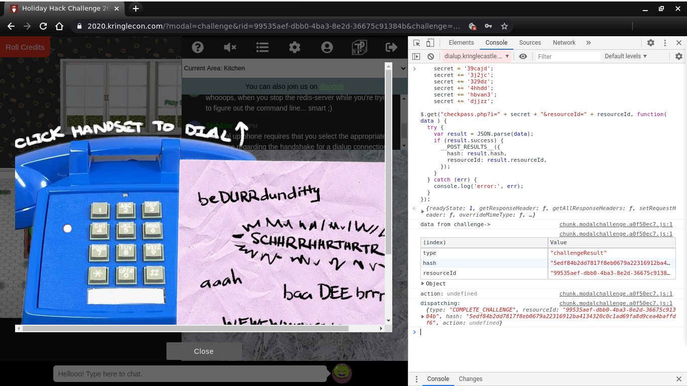

# Writeup for SANS Holiday Hack Challenge 2020 - 'Zat You, Santa Claus? featuring KringleCon 3: French Hens
# ?. 33.6 Kbps
## ?.0. Why is there a ? numbered chapter
The 33.6 Kbps challenge comes from Fitzy Shortstack, asking to help him troubleshoot his dial-up connection. From what I saw this challenge is neither in the objectives nor giving tracked hints for another one. Anyway I solved it pretty badly so also the numbering “?” seemed fair to me.
## ?.1. Description
The discussion with Fitzy Shortstack goes something like:  
> "Put it in the cloud," they said...  
> "It'll be great," they said...  
> All the lights on the Christmas trees throughout the castle are controlled through a remote server.  
> We can shuffle the colors of the lights by connecting via dial-up, but our only modem is broken!  
> Fortunately, I speak dial-up. However, I can't quite remember the handshake sequence.  
> Maybe you can help me out? The phone number is 756-8347; you can use this blue phone.
## ?.2. Solution
I started working with DTMF tones but laziness prevailed and here is my actual solution 😁  
I took a look at the [dialup.js](dialup.js) code behind the phone and noticed the variable secret that was being updated at every right step:
```javascript

pickup.addEventListener('click', () => {
  if (phase === 0) {
    phase = 1;
    playPhase();
    secret += '39cajd'
  } else {
    phase = 0;
    playPhase();
  }
});
btnrespCrEsCl.addEventListener('click', () => {
  if (phase === 3) {
    phase = 4;
    playPhase();
    secret += '3j2jc'
  } else {
    phase = 0;
    playPhase();
  }
  sfx.resp_cr_es_cl.play();
});
ack.addEventListener('click', () => {
  if (phase === 4) {
    phase = 5;
    playPhase();
    secret += '329dz'
  } else {
    phase = 0;
    playPhase();
  }
  sfx.ack.play();
});
cm_cj.addEventListener('click', () => {
  if (phase === 5) {
    phase = 6;
    playPhase();
    secret += '4hhdd'
  } else {
    phase = 0;
    playPhase();
  }
  sfx.cm_cj.play();
});
l1_l2_info.addEventListener('click', () => {
  if (phase === 6) {
    phase = 7;
    playPhase();
    secret += 'hbvan3'
  } else {
    phase = 0;
    playPhase();
  }
  sfx.l1_l2_info.play();
});
trn.addEventListener('click', () => {
  if (phase === 7) {
    phase = 8;
    secret += 'djjzz'
    playPhase();
  } else {
    phase = 0;
    playPhase();
  }
  sfx.trn.play();
});
```
Then the secret value was sent out with a GET request:
```javascript
$.get("checkpass.php?i=" + secret + "&resourceId=" + resourceId, function( data ) {
  try {
    var result = JSON.parse(data);
    if (result.success) {
      __POST_RESULTS__({
        hash: result.hash,
        resourceId: result.resourceId,
      });
    }
  } catch (err) {
    console.log('error:', err);
  }
});
```
I ran the instructions to build up the secret and send it out from the developer tools console and that made the trick:

## ?.3. ...actually...
Actually Fitzy Shortstack gave a suggestion regarding [Objective 5](TO_LINK), but why shouldn’t this challenge deserve its own section?

## ?.4. The hint
After completing the challenge Fitzy tells:  
>탢ݵרOُ񆨶$Ԩ؉楌Բ ahem! We did it! Thank you!!  
> Anytime you feel like changing the color scheme up, just pick up the phone!  
> You know, Santa really seems to trust Shinny Upatree…  

Shinny Upatree’s badge is the working one for Objective 5[Objective 5](TO_LINK).
## ?.5. Gentlemen, start your engines!


# 1. Uncover Santa's Gift List
# 2. Investigate S3 Bucket
# 3. Point-of-Sale Password Recovery
# 4. Operate the Santavator
# 5. Open HID Lock
# 6. Splunk Challenge
# 7. Solve the Sleigh's CAN-D-BUS Problem
# 8. Broken Tag Generator
# 9. ARP Shenanigans
# 10. Defeat Fingerprint Sensor
# 11a. Naughty/Nice List with Blockchain Investigation Part 1
# 11b. Naughty/Nice List with Blockchain Investigation Part 2
# [0. thedead@asian:~$ whoami](../README.md)