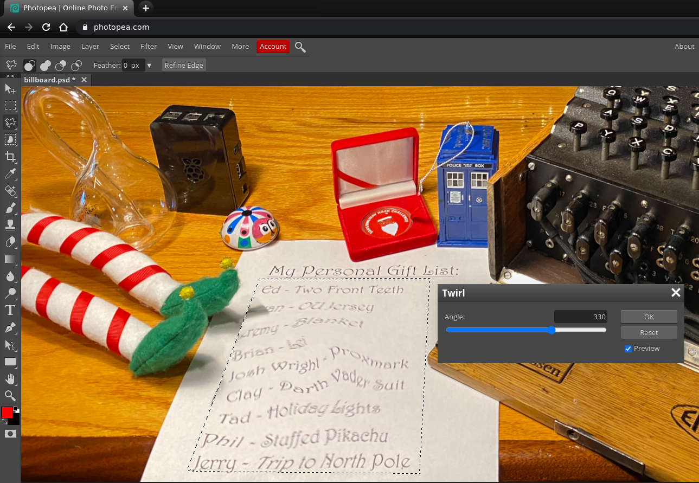

# Writeup for SANS Holiday Hack Challenge 2020 - 'Zat You, Santa Claus? featuring KringleCon 3: French Hens
# 1. Uncover Santa's Gift List
## 1.0. Description
There is a photo of Santa's Desk on that billboard with his personal gift list. What gift is Santa planning on getting Josh Wright for the holidays? Talk to Jingle Ringford at the bottom of the mountain for advice.
## 1.1. Hints
> **Twirl Area** - Jingle Ringford: *"Make sure you Lasso the correct twirly area."*
> **Image Edit Tool** - Jingle Ringford: *"There are tools out there that could help Filter the Distortion that is this Twirl."*
## 1.2. Solution
I spent a huge amount of time on the wrong picture:

Once I switched to a bigger monitor and got back at the beginning of the challenge I found the right one 😁  
So basically I just downloaded the image from the billboard at the entry:

Edited it with Photopea and found that Josh Wright wanted a Proxmark:

## 1.3. Fun facts
While uselessly scratching my head against Santa Portrait I uncovered a potential message by highlighting borders.  
Below the position of the letters found and their reconstruction:
  
  
  
Which I suppose may make sense with becoming Santa afterward, but who knows 😁
# 1. Uncover Santa's Gift List
# 2. Investigate S3 Bucket
# 3. Point-of-Sale Password Recovery
# 4. Operate the Santavator
# 5. Open HID Lock
# 6. Splunk Challenge
# 7. Solve the Sleigh's CAN-D-BUS Problem
# 8. Broken Tag Generator
# 9. ARP Shenanigans
# 10. Defeat Fingerprint Sensor
# 11a. Naughty/Nice List with Blockchain Investigation Part 1
# 11b. Naughty/Nice List with Blockchain Investigation Part 2
# 0. [thedead@asian:~$ whoami](../README.md)
# ?. [33.6 Kbps](../%20%3F.%2033.6%20Kbps/README.md)