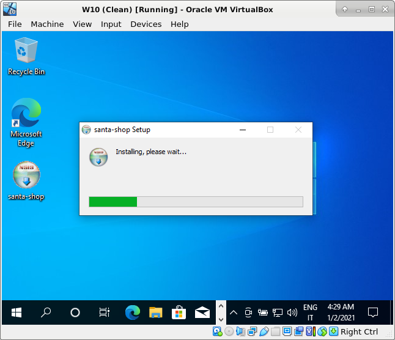
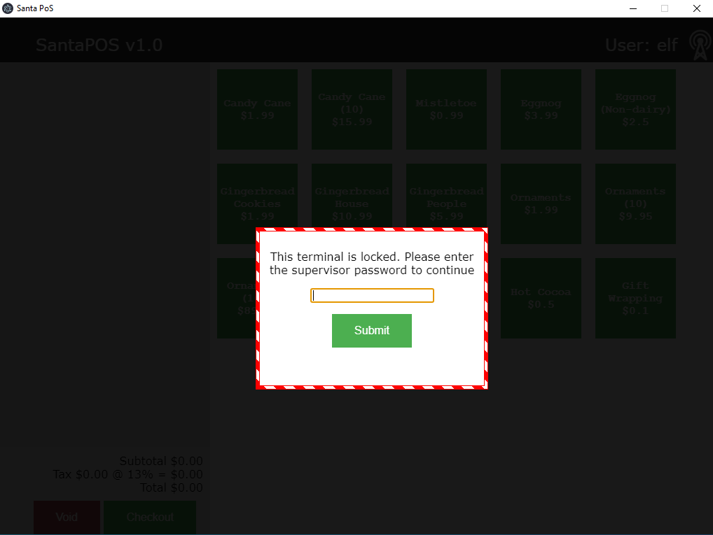
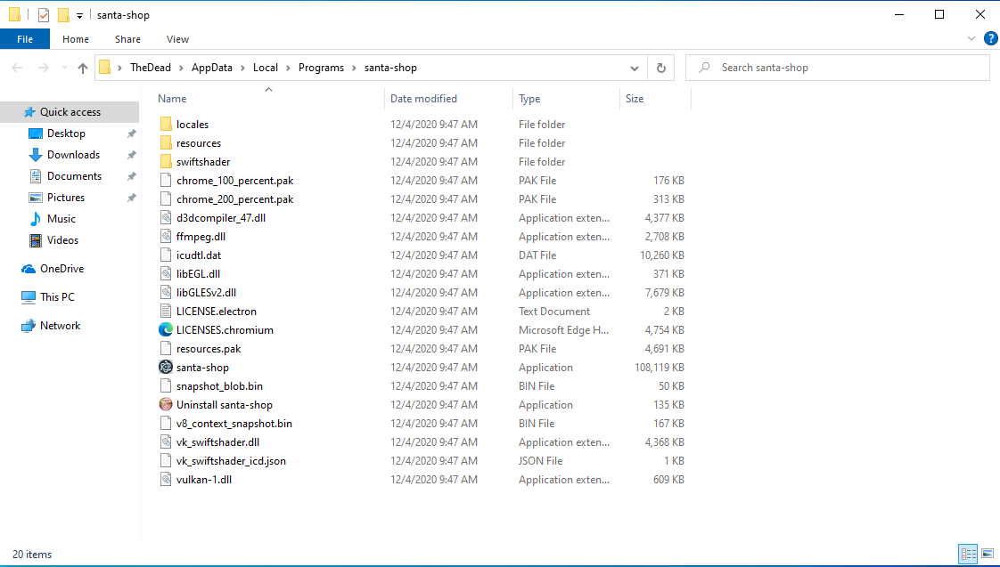
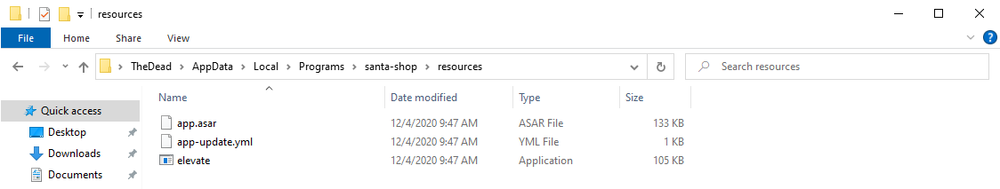

# Writeup for SANS Holiday Hack Challenge 2020 - 'Zat You, Santa Claus? featuring KringleCon 3: French Hens
# 3. Point-of-Sale Password Recovery
## 3.0. Description
Help Sugarplum Mary in the Courtyard find the supervisor password for the point-of-sale terminal. What's the password?
## 3.1. Side Challenge - Linux Primer
This challenge is about running a bunch of linux commands:
```bash
#───────────────────────────────────────────────────────────────────────────────────────────────────────────────────────────────────────────────────────────────────────────────────────────────────────────────────
# The North Pole 🍭 Lollipop Maker:
# All the lollipops on this system have been stolen by munchkins. Capture munchkins by following instructions here and 🍭's will appear in the green bar below. Run the command "hintme" to receive a hint.
#───────────────────────────────────────────────────────────────────────────────────────────────────────────────────────────────────────────────────────────────────────────────────────────────────────────────────
Type "yes" to begin: yes

#───────────────────────────────────────────────────────────────────────────────────────────────────────────────────────────────────────────────────────────────────────────────────────────────────────────────────
# Perform a directory listing of your home directory to find a munchkin and retrieve a lollipop!
#───────────────────────────────────────────────────────────────────────────────────────────────────────────────────────────────────────────────────────────────────────────────────────────────────────────────────
elf@c2ab96208fa0:~$ ls
HELP  munchkin_19315479765589239  workshop

#───────────────────────────────────────────────────────────────────────────────────────────────────────────────────────────────────────────────────────────────────────────────────────────────────────────────────
# Now find the munchkin inside the munchkin.
#───────────────────────────────────────────────────────────────────────────────────────────────────────────────────────────────────────────────────────────────────────────────────────────────────────────────────
elf@c2ab96208fa0:~$ cat munchkin_19315479765589239 
munchkin_24187022596776786

#───────────────────────────────────────────────────────────────────────────────────────────────────────────────────────────────────────────────────────────────────────────────────────────────────────────────────
# Great, now remove the munchkin in your home directory.
#───────────────────────────────────────────────────────────────────────────────────────────────────────────────────────────────────────────────────────────────────────────────────────────────────────────────────
elf@c2ab96208fa0:~$ rm munchkin_19315479765589239

#───────────────────────────────────────────────────────────────────────────────────────────────────────────────────────────────────────────────────────────────────────────────────────────────────────────────────
# Print the present working directory using a command.
#───────────────────────────────────────────────────────────────────────────────────────────────────────────────────────────────────────────────────────────────────────────────────────────────────────────────────
elf@c2ab96208fa0:~$ pwd
/home/elf

#───────────────────────────────────────────────────────────────────────────────────────────────────────────────────────────────────────────────────────────────────────────────────────────────────────────────────
# Good job but it looks like another munchkin hid itself in you home directory. Find the hidden munchkin!
#───────────────────────────────────────────────────────────────────────────────────────────────────────────────────────────────────────────────────────────────────────────────────────────────────────────────────
elf@94a0c57563e1:~$ ls -la | grep munchkin
-rw-r--r-- 1 elf  elf      0 Jan  2 02:19 .munchkin_5074624024543078

#───────────────────────────────────────────────────────────────────────────────────────────────────────────────────────────────────────────────────────────────────────────────────────────────────────────────────
# Excellent, now find the munchkin in your command history.
#───────────────────────────────────────────────────────────────────────────────────────────────────────────────────────────────────────────────────────────────────────────────────────────────────────────────────
elf@94a0c57563e1:~$ history | grep munchkin
    1  echo munchkin_9394554126440791
    3  cat munchkin_19315479765589239 
    4  rm munchkin_19315479765589239 
    7  find ./* | grep -i munchkin
   14  ls -la | grep munchkin
   15  history | grep munchkin

#───────────────────────────────────────────────────────────────────────────────────────────────────────────────────────────────────────────────────────────────────────────────────────────────────────────────────
# Find the munchkin in your environment variables.
#───────────────────────────────────────────────────────────────────────────────────────────────────────────────────────────────────────────────────────────────────────────────────────────────────────────────────
elf@94a0c57563e1:~$ env
LC_ALL=C.UTF-8
LS_COLORS=rs=0:di=01;34:ln=01;36:mh=00:pi=40;33:so=01;35:do=01;35:bd=40;33;01:cd=40;33;01:or=40;31;01:mi=00:su=37;41:sg=30;43:ca=30;41:tw=30;42:ow=34;42:st=37;44:ex=01;32:*.tar=01;31:*.tgz=01;31:*.arc=01;31:*.arj=01;31:*.taz=01;31:*.lha=01;31:*.lz4=01;31:*.lzh=01;31:*.lzma=01;31:*.tlz=01;31:*.txz=01;31:*.tzo=01;31:*.t7z=01;31:*.zip=01;31:*.z=01;31:*.Z=01;31:*.dz=01;31:*.gz=01;31:*.lrz=01;31:*.lz=01;31:*.lzo=01;31:*.xz=01;31:*.zst=01;31:*.tzst=01;31:*.bz2=01;31:*.bz=01;31:*.tbz=01;31:*.tbz2=01;31:*.tz=01;31:*.deb=01;31:*.rpm=01;31:*.jar=01;31:*.war=01;31:*.ear=01;31:*.sar=01;31:*.rar=01;31:*.alz=01;31:*.ace=01;31:*.zoo=01;31:*.cpio=01;31:*.7z=01;31:*.rz=01;31:*.cab=01;31:*.wim=01;31:*.swm=01;31:*.dwm=01;31:*.esd=01;31:*.jpg=01;35:*.jpeg=01;35:*.mjpg=01;35:*.mjpeg=01;35:*.gif=01;35:*.bmp=01;35:*.pbm=01;35:*.pgm=01;35:*.ppm=01;35:*.tga=01;35:*.xbm=01;35:*.xpm=01;35:*.tif=01;35:*.tiff=01;35:*.png=01;35:*.svg=01;35:*.svgz=01;35:*.mng=01;35:*.pcx=01;35:*.mov=01;35:*.mpg=01;35:*.mpeg=01;35:*.m2v=01;35:*.mkv=01;35:*.webm=01;35:*.ogm=01;35:*.mp4=01;35:*.m4v=01;35:*.mp4v=01;35:*.vob=01;35:*.qt=01;35:*.nuv=01;35:*.wmv=01;35:*.asf=01;35:*.rm=01;35:*.rmvb=01;35:*.flc=01;35:*.avi=01;35:*.fli=01;35:*.flv=01;35:*.gl=01;35:*.dl=01;35:*.xcf=01;35:*.xwd=01;35:*.yuv=01;35:*.cgm=01;35:*.emf=01;35:*.ogv=01;35:*.ogx=01;35:*.aac=00;36:*.au=00;36:*.flac=00;36:*.m4a=00;36:*.mid=00;36:*.midi=00;36:*.mka=00;36:*.mp3=00;36:*.mpc=00;36:*.ogg=00;36:*.ra=00;36:*.wav=00;36:*.oga=00;36:*.opus=00;36:*.spx=00;36:*.xspf=00;36:
TOKENS=
LESSCLOSE=/usr/bin/lesspipe %s %s
LANG=C.UTF-8
HOSTNAME=94a0c57563e1
GREENSTATUSPREFIX=Lollipops
USER=elf
HHCUSERNAME=TheDead
PWD=/home/elf
AREA=courtyard
HOME=/home/elf
TMUX=/tmp/tmux-1050/default,16,0
BPUSER=elf
z_MUNCHKIN=munchkin_20249649541603754
LOCATION=17,14
RESOURCE_ID=939dbb47-73f9-4b7d-8b0d-662493935e0e
MAIL=/var/mail/elf
SHELL=/bin/bash
TERM=screen
TMOUT=3600
TMUX_PANE=%2
SHLVL=4
BPUSERHOME=/home/elf
SESSNAME=Munchkin Wrangler
LOGNAME=elf
PATH=/usr/local/sbin:/usr/local/bin:/usr/sbin:/usr/bin:/sbin:/bin:/usr/games:/usr/local/games:/snap/bin
LESSOPEN=| /usr/bin/lesspipe %s
_=/usr/bin/env

#───────────────────────────────────────────────────────────────────────────────────────────────────────────────────────────────────────────────────────────────────────────────────────────────────────────────────
# Next, head into the workshop.
#───────────────────────────────────────────────────────────────────────────────────────────────────────────────────────────────────────────────────────────────────────────────────────────────────────────────────
elf@94a0c57563e1:~$ cd workshop/

#───────────────────────────────────────────────────────────────────────────────────────────────────────────────────────────────────────────────────────────────────────────────────────────────────────────────────
# A munchkin is hiding in one of the workshop toolboxes. Use "grep" while ignoring case to find which toolbox the munchkin is in.
#───────────────────────────────────────────────────────────────────────────────────────────────────────────────────────────────────────────────────────────────────────────────────────────────────────────────────
elf@94a0c57563e1:~/workshop$ grep -i munchkin *
grep: electrical: Is a directory
toolbox_191.txt:mUnChKin.4056180441832623

#───────────────────────────────────────────────────────────────────────────────────────────────────────────────────────────────────────────────────────────────────────────────────────────────────────────────────
# A munchkin is blocking the lollipop_engine from starting. Run the lollipop_engine binary to retrieve this munchkin.
#───────────────────────────────────────────────────────────────────────────────────────────────────────────────────────────────────────────────────────────────────────────────────────────────────────────────────
elf@94a0c57563e1:~/workshop$ chmod +x lollipop_engine 
elf@94a0c57563e1:~/workshop$ ./lollipop_engine
munchkin.898906189498077

#───────────────────────────────────────────────────────────────────────────────────────────────────────────────────────────────────────────────────────────────────────────────────────────────────────────────────
# Munchkins have blown the fuses in /home/elf/workshop/electrical. cd into electrical and rename blown_fuse0 to fuse0.
#───────────────────────────────────────────────────────────────────────────────────────────────────────────────────────────────────────────────────────────────────────────────────────────────────────────────────
elf@94a0c57563e1:~/workshop$ cd electrical/
elf@94a0c57563e1:~/workshop/electrical$ mv blown_fuse0 fuse0

#───────────────────────────────────────────────────────────────────────────────────────────────────────────────────────────────────────────────────────────────────────────────────────────────────────────────────
# Now, make a symbolic link (symlink) named fuse1 that points to fuse0
#───────────────────────────────────────────────────────────────────────────────────────────────────────────────────────────────────────────────────────────────────────────────────────────────────────────────────
elf@94a0c57563e1:~/workshop/electrical$ ln -s fuse0 fuse1

#───────────────────────────────────────────────────────────────────────────────────────────────────────────────────────────────────────────────────────────────────────────────────────────────────────────────────
# Make a copy of fuse1 named fuse2.
#───────────────────────────────────────────────────────────────────────────────────────────────────────────────────────────────────────────────────────────────────────────────────────────────────────────────────
elf@94a0c57563e1:~/workshop/electrical$ cp fuse1 fuse2

#───────────────────────────────────────────────────────────────────────────────────────────────────────────────────────────────────────────────────────────────────────────────────────────────────────────────────
# We need to make sure munchkins don't come back. Add the characters "MUNCHKIN_REPELLENT" into the file fuse2.
#───────────────────────────────────────────────────────────────────────────────────────────────────────────────────────────────────────────────────────────────────────────────────────────────────────────────────
elf@94a0c57563e1:~/workshop/electrical$ echo "MUNCHKIN_REPELLENT" >> fuse2 

#───────────────────────────────────────────────────────────────────────────────────────────────────────────────────────────────────────────────────────────────────────────────────────────────────────────────────
# Find the munchkin somewhere in /opt/munchkin_den.
#───────────────────────────────────────────────────────────────────────────────────────────────────────────────────────────────────────────────────────────────────────────────────────────────────────────────────
elf@9a851a9d8aab:~$ find /opt/munchkin_den/*
#[..omississ..]

#───────────────────────────────────────────────────────────────────────────────────────────────────────────────────────────────────────────────────────────────────────────────────────────────────────────────────
# Find the file somewhere in /opt/munchkin_den that is owned by the user munchkin.
#───────────────────────────────────────────────────────────────────────────────────────────────────────────────────────────────────────────────────────────────────────────────────────────────────────────────────
elf@94a0c57563e1:~/workshop/electrical$ find /opt/munchkin_den/ -user munchkin
/opt/munchkin_den/apps/showcase/src/main/resources/template/ajaxErrorContainers/niKhCnUm_9528909612014411

#───────────────────────────────────────────────────────────────────────────────────────────────────────────────────────────────────────────────────────────────────────────────────────────────────────────────────
# Find the file created by munchkins that is greater than 108 kilobytes and less than 110 kilobytes located somewhere in /opt/munchkin_den.
#───────────────────────────────────────────────────────────────────────────────────────────────────────────────────────────────────────────────────────────────────────────────────────────────────────────────────
elf@94a0c57563e1:~/workshop/electrical$ find /opt/munchkin_den/ -type f -size +108k -size -110k 
/opt/munchkin_den/plugins/portlet-mocks/src/test/java/org/apache/m_u_n_c_h_k_i_n_2579728047101724

#───────────────────────────────────────────────────────────────────────────────────────────────────────────────────────────────────────────────────────────────────────────────────────────────────────────────────
# List running processes to find another munchkin.
#───────────────────────────────────────────────────────────────────────────────────────────────────────────────────────────────────────────────────────────────────────────────────────────────────────────────────
elf@94a0c57563e1:~/workshop/electrical$ ps -fae | grep munchkin
elf      18689 18686  1 02:30 pts/2    00:00:00 /usr/bin/python3 /14516_munchkin
elf      19230   201  0 02:30 pts/3    00:00:00 grep --color=auto munchkin

#───────────────────────────────────────────────────────────────────────────────────────────────────────────────────────────────────────────────────────────────────────────────────────────────────────────────────
# The 14516_munchkin process is listening on a tcp port. Use a command to have the only listening port display to the screen.
#───────────────────────────────────────────────────────────────────────────────────────────────────────────────────────────────────────────────────────────────────────────────────────────────────────────────────
elf@94a0c57563e1:~/workshop/electrical$ netstat -l
Active Internet connections (only servers)
Proto Recv-Q Send-Q Local Address           Foreign Address         State      
tcp        0      0 0.0.0.0:54321           0.0.0.0:*               LISTEN     
Active UNIX domain sockets (only servers)
Proto RefCnt Flags       Type       State         I-Node   Path
unix  2      [ ACC ]     STREAM     LISTENING     651448615 /tmp/tmux-1050/default

#───────────────────────────────────────────────────────────────────────────────────────────────────────────────────────────────────────────────────────────────────────────────────────────────────────────────────
# The service listening on port 54321 is an HTTP server. Interact with this server to retrieve the last munchkin.
#───────────────────────────────────────────────────────────────────────────────────────────────────────────────────────────────────────────────────────────────────────────────────────────────────────────────────
elf@94a0c57563e1:~/workshop/electrical$ curl http://localhost:54321
munchkin.73180338045875

#───────────────────────────────────────────────────────────────────────────────────────────────────────────────────────────────────────────────────────────────────────────────────────────────────────────────────
# Your final task is to stop the 14516_munchkin process to collect the remaining lollipops.
#───────────────────────────────────────────────────────────────────────────────────────────────────────────────────────────────────────────────────────────────────────────────────────────────────────────────────
elf@94a0c57563e1:~/workshop/electrical$ kill 18689

#───────────────────────────────────────────────────────────────────────────────────────────────────────────────────────────────────────────────────────────────────────────────────────────────────────────────────
# Congratulations, you caught all the munchkins and retrieved all the lollipops!
# Type "exit" to close..
#───────────────────────────────────────────────────────────────────────────────────────────────────────────────────────────────────────────────────────────────────────────────────────────────────────────────────.
elf@94a0c57563e1:~/workshop/electrical$ exit
```
## 3.2. Hints
> **Electron Applications** - Sugarplum Mary: *“It's possible to extract the source code from an Electron app.”*  
> **Electron ASAR Extraction** - Sugarplum Mary: *“There are tools and guides explaining how to extract ASAR from Electron apps.”*  
## 3.3. Solution
I downloaded the `santa-shop.exe` application to a Windows virtual machine and ran it:


It installed itself within the `%appdata%` folder:

In the resources directory I could find the `app.asar` file:

I copied back the application to the host and extract it to a dedicated folder with `asar extract app.asar`:
```bash
thedead@dellian:~/Desktop/repos/KringleCon3/03. Point-of-Sale Password Recovery/santa-shop/asar application$ asar extract app.asar extracted_app
```
In the folder to which `asar.app` was extracted, the [`main.js`](santa-shop/asar%20application/extracted_app/main.js) file contains a constant `SANTA_PASSWORD` with value `'santapass'`.
```bash
thedead@dellian:~/Desktop/repos/KringleCon3/03. Point-of-Sale Password Recovery/santa-shop/asar application$ grep -i password extracted_app/main.js 
const SANTA_PASSWORD = 'santapass';
ipcMain.handle('unlock', (event, password) => {
  return (password === SANTA_PASSWORD);
```
## 3.4. What if...?
What if your ecommerce application does not validate input against negative quantities of the product and the invoice program fixes it with the abs function?  


---
# 4. [Operate the Santavator](../04.%20Operate%20the%20Santavator/README.md)
# 5. [Open HID Lock](../05.%20Open%20HID%20Lock/README.md)
# 6. [Splunk Challenge](../06.%20Splunk%20Challenge/README.md)
# 7. [Solve the Sleigh's CAN-D-BUS Problem](../07.%20Solve%20the%20Sleigh's%20CAN-D-BUS%20Problem/README.md)
# 8. [Broken Tag Generator](../08.%20Broken%20Tag%20Generator/README.md)
# 9. [ARP Shenanigans](../09.%20ARP%20Shenanigans/README.md)
# 10. [Defeat Fingerprint Sensor](../10.%20Defeat%20Fingerprint%20Sensor/README.md)
# 11a. [Naughty/Nice List with Blockchain Investigation Part 1](../11a.%20Naughty-Nice%20List%20with%20Blockchain%20Investigation%20Part%201/README.md)
# 11b. [Naughty/Nice List with Blockchain Investigation Part 2](../11b.%20Naughty-Nice%20List%20with%20Blockchain%20Investigation%20Part%202/README.md)
---
# 0. [thedead@asian:~$ whoami](../README.md)
# ?. 33.6 Kbps
# 1. Uncover Santa's Gift List
# 2. Investigate S3 Bucket