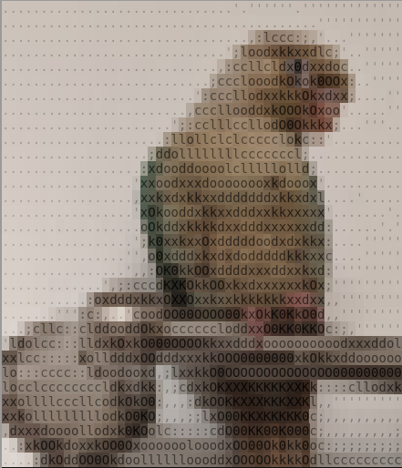
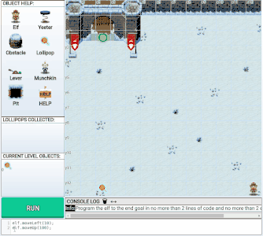
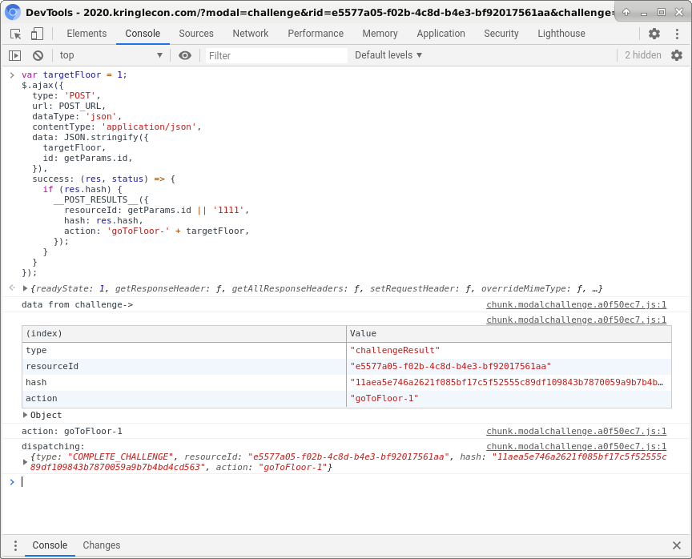
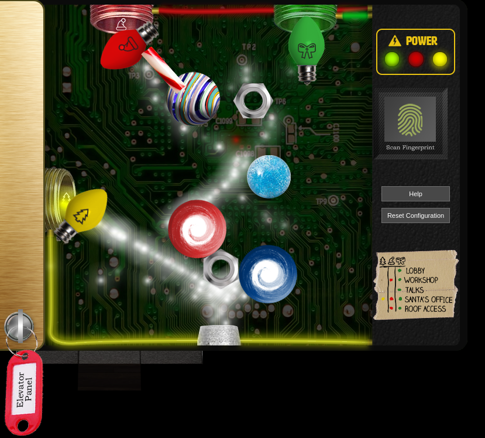

# Writeup for SANS Holiday Hack Challenge 2020 - 'Zat You, Santa Claus? featuring KringleCon 3: French Hens
# 4. Operate the Santavator
## 4.0. Description
Talk to Pepper Minstix in the entryway to get some hints about the Santavator.
## 4.1. Side Challenge - Unescape tmux
Running `tmux attach` to get back to the detached session solved the challenge and found Pepper Minstix’s birdie:
```bash
#Can you help me?
#I was playing with my birdie (she's a Green Cheek!) in something called tmux,
#then I did something and it disappeared!
#Can you help me find her? We were so attached!!
elf@f79de69a537b:~$ tmux attach
..............................'.''''''.'''''''''''''
.........................................'''''''''''
................................,:lccc:;,'...'''''''
.............................';loodxkkxxdlc;'..'''''
............................,:ccllcldx0dxxdoc..'''''
...........................;ccclooodkOkok0OOx:..''''
.........................':cccllodxxkkkOkxdxx;....''
........................,cccllooddxkOOOkOxoo'.....''
......................';:cclllccllodO0Okkkx;...'''..
.....................:llollclclccccclokc::'.........
...................;ddollllllllcccccccl;............
..................:xdooddoooolclllllolld;...........
.................'xxoodxxxdoooooooxkdooox'..........
.................,xxkxdxkkxxdddddddxkkxdxl....'.....
.................'xOkooddxkkxxdddxxkkxxxxx'.......'.
..................oOkddxkkkkdxxdddxxxxxxdd:......'.'
.................';k0xxkxxOxdddddoodxdxkkx:....'''''
................'',o0xdddxkxdxdodddddkkkxxc....'''''
................',,:OK0kkOOxddddxxxddxxkxd:'''''''''
.............',;:cccdKXKOkkOOxkxdxxxxxxkOx;'''''''''
...........:oxdddxkkxOXXOxxkxxkkkkkkkxxdxx,,''''''''
.......''':c:,..'coodOO00OOOO00kxOkK0KkO0d,,''''''''
...;cllc::clddooddOkxoccccccloddxxO0KK0KKOc:;,''''''
'ldolcc:::lldxkOxkO000OOOOkkxxdddxoooooooooodxxxddol
xxlcc:::::xolldddxOOdddxxxkkOOO0000000xkOkkxddoooooo
lo:::cccc::ldoodooxd,;lxxkkO0OOOOOOOOOOOOOO000000000
locclccccccccldkxdkk:,;cdxkOKXXXKKKKKXXKk::::cllodxk
xxollllcccllcodkOkO0:,,,:dkOOKKXXXKKKXXKl,,'''''''''
xxkolllllllllodkO0KO;,,,;;lxO00KKXKKKKK0c;,,,,,,,,,,
,dxxxdoooollodxk0KOolc:::::cdO00KK00K000c;,,,,,,,,,;
..:xkOOkdoxxkOO0OxoooooolooodxOO00Ok0kk0oc:;;;;;;;;;
....:dkOddOO0OkdoolllllloooddxOOOOOkkkkOdllccccccccc

You found her! Thank you!!!

[0] 0:bash*                                                 "f79de69a537b" 13:00 02-Jan-21
[0] 0:bash*                                                 "f79de69a537b" 13:01 02-Jan-21
```

## 4.2. Side Challenge - The Elf C0de
This challenge is about helping an Elf to reach the exit in a map using javascript.
### 4.1.1 Level 1
```javascript
elf.moveLeft(10);
elf.moveUp(100);
```

### 4.1.2 Level 2
```javascript
elf.moveLeft(6);
elf.pull_lever(elf.get_lever(0) + 2);
elf.moveLeft(4);
elf.moveUp(100);
```

### 4.1.3 Level 3
```javascript
elf.moveTo(lollipop[0]);
elf.moveTo(lollipop[1]);
elf.moveTo(lollipop[2]);
elf.moveUp(100);
```

### 4.1.4 Level 4
```javascript
for (i = 0; i < 3; i++) {
  elf.moveUp(100);
  elf.moveLeft(3);
  elf.moveDown(100);
  elf.moveLeft(3);
}
elf.moveUp(100);
```

### 4.1.5 Level 5
```javascript
elf.moveTo(lollipop[1]);
elf.moveTo(lollipop[0]);
q = elf.ask_munch(0);
a = [];
for (i = 0; i < q.length; i++) {
  if (!isNaN(q[i]))
    a.push(q[i])
}
elf.tell_munch(a);
elf.moveUp(10);
```

### 4.1.6 Level 6
```javascript
for (i = 0; i < 4; i++)
  elf.moveTo(lollipop[i]);
elf.moveLeft(8);
elf.moveUp(2);
q = elf.ask_munch(0);
for (key in q)
  if (q[key] == "lollipop")
    elf.tell_munch(key);
elf.moveUp(10);
```

### 4.1.7 Level 7
```javascript
function f(q) {
  a = 0;
  for (i = 0; i < q.length; i++)
    for (j = 0; j < q[i].length; j++)
      if (!isNaN(q[i][j])) a += q[i][j]
  return a;
}
for (i = 0; i < 8; i++) {
  if (i % 4 == 0) elf.moveDown(i + 1);
  if (i % 4 == 1) elf.moveLeft(i + 1);
  if (i % 4 == 2) elf.moveUp(i + 1);
  if (i % 4 == 3) elf.moveRight(i + 1);
  elf.pull_lever(i);

}
elf.moveUp(2);
elf.moveLeft(4);
elf.tell_munch(f);
elf.moveUp(100);
```

### 4.1.8 Level 8
I just want to point out the laziness applied against brain to solve the 8th level here:
```javascript
function f(q) {
  a = 0;
  for (i = 0; i < q.length; i++)
    for (key in q[i])
      if (q[i][key] == "lollipop")
        return key;
}

moves = ['1_>', '1_L', '2_^', '3_<', '1_L', '2_^', '5_>', '1_L', '2_^', '7_<', '1_L', '2_^', '9_>', '1_L', '2_^', '11_<', '1_L', '2_^', '1_M', '12_>'];
sum = 0;
lever_count = 0;
for (i=0; i<moves.length; i++) {
  var times = moves[i].split('_')[0];
  var move = moves[i].split('_')[1];
    for (j=0; j<times; j++) {
      if (move == '>') elf.moveRight(1);
    if (move == '<') elf.moveLeft(1);
    if (move == '^') elf.moveUp(1);
    if (move == 'L') {
      sum += elf.get_lever(lever_count);
      elf.pull_lever(sum);
      lever_count++;
    }
    if (move == 'M') elf.tell_munch(f);
    }
}
```

## 4.3. Hints
> **Santavator Operations** - Pepper Minstix: *“It's really more art than science. The goal is to put the right colored light into the receivers on the left and top of the panel.”*  
> **Santavator Bypass** - Ribb Bonbowford: *“There may be a way to bypass the Santavator S4 game with the browser console...”*
## 4.4. Solution
The santavator itself is basically a javascript application which contains two functions to handle when a user presses a button: `handleBtn()` and `handleBtn4()`. By directly calling the content of these functions with proper variables set it was possible to make the santavator move to another floor.
```javascript
const handleBtn = event => {
  const targetFloor = event.currentTarget.attributes['data-floor'].value;
  $.ajax({
    type: 'POST',
    url: POST_URL,
    dataType: 'json',
    contentType: 'application/json',
    data: JSON.stringify({ 
      targetFloor,
      id: getParams.id,
    }),
    success: (res, status) => {
      if (res.hash) {
        __POST_RESULTS__({
          resourceId: getParams.id || '1111',
          hash: res.hash,
          action: `goToFloor-${targetFloor}`,
        });
      }
    }
  });
}

const handleBtn4 = () => {
  const cover = document.querySelector('.print-cover');
  cover.classList.add('open');

  cover.addEventListener('click', () => {
    if (btn4.classList.contains('powered') && hasToken('besanta')) {
      $.ajax({
        type: 'POST',
        url: POST_URL,
        dataType: 'json',
        contentType: 'application/json',
        data: JSON.stringify({ 
          targetFloor: '3',
          id: getParams.id,
        }),
        success: (res, status) => {
          if (res.hash) {
            __POST_RESULTS__({
              resourceId: getParams.id || '1111',
              hash: res.hash,
              action: 'goToFloor-3',
            });
          }
        }
      });
    } else {
      __SEND_MSG__({
        type: 'sfx',
        filename: 'error.mp3',
      });
    }
  });
};
```
### 4.4.1. Floor 1
```javascript
var targetFloor = 1;
$.ajax({
  type: 'POST',
  url: POST_URL,
  dataType: 'json',
  contentType: 'application/json',
  data: JSON.stringify({ 
    targetFloor,
    id: getParams.id,
  }),
  success: (res, status) => {
    if (res.hash) {
      __POST_RESULTS__({
        resourceId: getParams.id || '1111',
        hash: res.hash,
        action: 'goToFloor-' + targetFloor,
      });
    }
  }
});
```

### 4.4.2. Floor 1.5
```javascript
var targetFloor = 1.5;
$.ajax({
  type: 'POST',
  url: POST_URL,
  dataType: 'json',
  contentType: 'application/json',
  data: JSON.stringify({ 
    targetFloor,
    id: getParams.id,
  }),
  success: (res, status) => {
    if (res.hash) {
      __POST_RESULTS__({
        resourceId: getParams.id || '1111',
        hash: res.hash,
        action: 'goToFloor-' + targetFloor,
      });
    }
  }
});
```

### 4.4.3. Floor 2
```javascript
var targetFloor = 2;
$.ajax({
  type: 'POST',
  url: POST_URL,
  dataType: 'json',
  contentType: 'application/json',
  data: JSON.stringify({ 
    targetFloor,
    id: getParams.id,
  }),
  success: (res, status) => {
    if (res.hash) {
      __POST_RESULTS__({
        resourceId: getParams.id || '1111',
        hash: res.hash,
        action: 'goToFloor-' + targetFloor,
      });
    }
  }
});
```

### 4.4.4. Floor 3
```javascript
var targetFloor = 3;
$.ajax({
  type: 'POST',
  url: POST_URL,
  dataType: 'json',
  contentType: 'application/json',
  data: JSON.stringify({ 
    targetFloor,
    id: getParams.id,
  }),
  success: (res, status) => {
    if (res.hash) {
      __POST_RESULTS__({
        resourceId: getParams.id || '1111',
        hash: res.hash,
        action: 'goToFloor-' + targetFloor,
      });
    }
  }
});
```

### 4.4.4. Floor r
```javascript
var targetFloor = "r";
$.ajax({
  type: 'POST',
  url: POST_URL,
  dataType: 'json',
  contentType: 'application/json',
  data: JSON.stringify({ 
    targetFloor,
    id: getParams.id,
  }),
  success: (res, status) => {
    if (res.hash) {
      __POST_RESULTS__({
        resourceId: getParams.id || '1111',
        hash: res.hash,
        action: 'goToFloor-' + targetFloor,
      });
    }
  }
});
```

## 4.5. “It's really more art than science”
Once obtained all objects it was possible to power up the santavator properly. I think I made it really bad so here’s the screenshot of all pieces in “artistic” places:  


---
# 5. [Open HID Lock](../05.%20Open%20HID%20Lock/README.md)
# 6. [Splunk Challenge](../06.%20Splunk%20Challenge/README.md)
# 7. [Solve the Sleigh's CAN-D-BUS Problem](../07.%20Solve%20the%20Sleigh's%20CAN-D-BUS%20Problem/README.md)
# 8. [Broken Tag Generator](../08.%20Broken%20Tag%20Generator/README.md)
# 9. [ARP Shenanigans](../09.%20ARP%20Shenanigans/README.md)
# 10. [Defeat Fingerprint Sensor](../10.%20Defeat%20Fingerprint%20Sensor/README.md)
# 11a. [Naughty/Nice List with Blockchain Investigation Part 1](../11a.%20Naughty-Nice%20List%20with%20Blockchain%20Investigation%20Part%201/README.md)
# 11b. [Naughty/Nice List with Blockchain Investigation Part 2](../11b.%20Naughty-Nice%20List%20with%20Blockchain%20Investigation%20Part%202/README.md)

---
# 0. [thedead@asian:~$ whoami](../README.md)
# ?. [33.6 Kbps](../%20%3F.%2033.6%20Kbps/README.md)
# 1. [Uncover Santa's Gift List](../01.%20Uncover%20Santa's%20Gift%20List/README.md)
# 2. [Investigate S3 Bucket](../02.%20Investigate%20S3%20Bucket/README.md)
# 3. [Point-of-Sale Password Recovery](../03.%20Point-of-Sale%20Password%20Recovery/README.md)