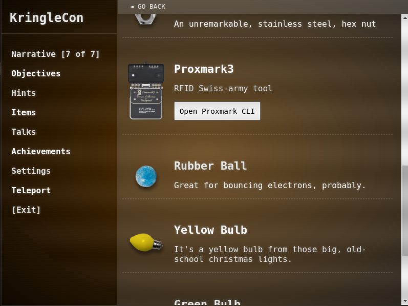

# Writeup for SANS Holiday Hack Challenge 2020 - 'Zat You, Santa Claus? featuring KringleCon 3: French Hens
# 5. Open HID Lock
## 5.0 Description
Open the HID lock in the Workshop. Talk to Bushy Evergreen near the talk tracks for hints on this challenge. You may also visit Fitzy Shortstack in the kitchen for tips.
## 5.1. Side Challenge - Speaker UNPrep
The aim of the challenge is to overcome passwords within three executables: `door`, `lights` and `vending-machines`.  
Regarding the `door` executable, the password was contained as a plaintext string within it so the `strings` command made it to password `Op3nTheD00r`:  
```bash
elf@73ec330920b2 ~ $ ls 
door  lab  lights  lights.conf  vending-machines  vending-machines.json
elf@73ec330920b2 ~ $ strings door | grep -i password
/home/elf/doorYou look at the screen. It wants a password. You roll your eyes - the 
password is probably stored right in the binary. There's gotta be a
Be sure to finish the challenge in prod: And don't forget, the password is "Op3nTheD00r"
Beep boop invalid password
elf@73ec330920b2 ~ $ ./door 
You look at the screen. It wants a password. You roll your eyes - the 
password is probably stored right in the binary. There's gotta be a
tool for this...

What do you enter? > Op3nTheD00r
Checking......

Door opened!
```
The `lights` executable relies on the `lights.conf` configuration file with fields `name` and `password`. It’s execution leads to the hint that some decryption of these fields was being performed. Switching the values in the lab made the trick, causing the executable itself to print the decrypted content of the password `Computer-TurnLightsOn`:
```bash
elf@73ec330920b2 ~ $ cat lights.conf 
password: E$ed633d885dcb9b2f3f0118361de4d57752712c27c5316a95d9e5e5b124
name: elf-technician
elf@73ec330920b2 ~ $ cd lab
elf@e725d14b2eb0 ~/lab $ cat lights.conf 
name: E$ed633d885dcb9b2f3f0118361de4d57752712c27c5316a95d9e5e5b124
password:
elf@e725d14b2eb0 ~/lab $ ./lights 
The speaker unpreparedness room sure is dark, you're thinking (assuming
you've opened the door; otherwise, you wonder how dark it actually is)

You wonder how to turn the lights on? If only you had some kind of hin---

 >>> CONFIGURATION FILE LOADED, SELECT FIELDS DECRYPTED: /home/elf/lab/lights.conf

---t to help figure out the password... I guess you'll just have to make do!

The terminal just blinks: Welcome back, Computer-TurnLightsOn

What do you enter? > 
Checking......
That would have turned on the lights!

If you've figured out the real password, be sure you run /home/elf/lights
elf@e725d14b2eb0 ~ $ ./lights 
The speaker unpreparedness room sure is dark, you're thinking (assuming
you've opened the door; otherwise, you wonder how dark it actually is)

You wonder how to turn the lights on? If only you had some kind of hin---

 >>> CONFIGURATION FILE LOADED, SELECT FIELDS DECRYPTED: /home/elf/lights.conf

---t to help figure out the password... I guess you'll just have to make do!

The terminal just blinks: Welcome back, elf-technician

What do you enter? > Computer-TurnLightsOn
Checking......

Lights on!
```
`vending-machine` relies on `vending-machines.json` configuration file and gives the hint to remove it. Removing it in the lab the executable recreates it, and inserting the same character more times it was possible to determine that the encryption was a basic polyalphabetic substitution and that the length of the key was 8 chars. At that point I just ran the executable with all printable ASCII characters and then decrypted the original password string `LVEdQPpBwr` to `CandyCane1`:
```bash
elf@1fb6c9052b21 ~/lab $ ./vending-machines 
The elves are hungry!

If the door's still closed or the lights are still off, you know because
you can hear them complaining about the turned-off vending machines!
You can probably make some friends if you can get them back on...

Loading configuration from: /home/elf/lab/vending-machines.json

I wonder what would happen if it couldn't find its config file? Maybe that's
something you could figure out in the lab...

ALERT! ALERT! Configuration file is missing! New Configuration File Creator Activated!

Please enter the name > AAAAAAAAAAAAAAAA
Please enter the password > AAAAAAAAAAAAAAAA

Welcome, AAAAAAAAAAAAAAAA! It looks like you want to turn the vending machines back on?
Please enter the vending-machine-back-on code > 
Checking......
Beep boop invalid password
```
```bash
elf@1fb6c9052b21 ~/lab $ cat vending-machines.json 
{
  "name": "AAAAAAAAAAAAAAAA",
  "password": "XiGRehmwXiGRehmw"
 }
elf@1fb6c9052b21 ~/lab $ ./vending-machines 
The elves are hungry!

If the door's still closed or the lights are still off, you know because
you can hear them complaining about the turned-off vending machines!
You can probably make some friends if you can get them back on...

Loading configuration from: /home/elf/lab/vending-machines.json

I wonder what would happen if it couldn't find its config file? Maybe that's
something you could figure out in the lab...

ALERT! ALERT! Configuration file is missing! New Configuration File Creator Activated!

Please enter the name > BBBBBBBBBBBBBBBB
Please enter the password > BBBBBBBBBBBBBBBB

Welcome, BBBBBBBBBBBBBBBB! It looks like you want to turn the vending machines back on?
Please enter the vending-machine-back-on code > 
Checking......
Beep boop invalid password
```
```bash
elf@1fb6c9052b21 ~/lab $ cat vending-machines.json 
{
  "name": "BBBBBBBBBBBBBBBB",
  "password": "DqTpKv7fDqTpKv7f"
}
elf@1fb6c9052b21 ~/lab $ ./vending-machines 
The elves are hungry!

If the door's still closed or the lights are still off, you know because
you can hear them complaining about the turned-off vending machines!
You can probably make some friends if you can get them back on...

Loading configuration from: /home/elf/lab/vending-machines.json

I wonder what would happen if it couldn't find its config file? Maybe that's
something you could figure out in the lab...

ALERT! ALERT! Configuration file is missing! New Configuration File Creator Activated!

Please enter the name > ABABABABABABABAB
Please enter the password > ABABABABABABABAB

Welcome, ABABABABABABABAB! It looks like you want to turn the vending machines back on?
Please enter the vending-machine-back-on code > 
Checking......
Beep boop invalid password
```
```bash
elf@1fb6c9052b21 ~/lab $ cat vending-machines.json | tail -n2 | head -n1 | cut -d '"' -f4
XqGpevmfXqGpevmf
elf@1fb6c9052b21 ~/lab $ for ((i=32;i<127;i++));
> do
> char=$(printf "\\$(printf %03o "$i")")
> char=$(printf "%0.s$char" {1..16})
> echo -e "$char\n$char\n$char\n" | ./vending-machines 1>/dev/null
> enc=$(cat vending-machines.json | tail -n2 | head -n1 | cut -d '"' -f4)
> rm vending-machines.json
> echo -e "$char\t$enc"
> done
                   ################
!!!!!!!!!!!!!!!!   !!!!!!!!!!!!!!!!
""""""""""""""""   \
################   ################
$$$$$$$$$$$$$$$$   $$$$$$$$$$$$$$$$

&&&&&&&&&&&&&&&&   &&&&&&&&&&&&&&&&
''''''''''''''''   ''''''''''''''''
((((((((((((((((   ((((((((((((((((
))))))))))))))))   ))))))))))))))))
****************   ****************
++++++++++++++++   ++++++++++++++++
,,,,,,,,,,,,,,,,   ,,,,,,,,,,,,,,,,
----------------   ----------------
................   ................
eeeeeeeeeeeeeeee   wcZQAYuewcZQAYue
////////////////   ////////////////
0000000000000000   3ehm9ZFH3ehm9ZFH
1111111111111111   2rDO5LkI2rDO5LkI
2222222222222222   pWFLz5zSpWFLz5zS
3333333333333333   WJ1YbNtlWJ1YbNtl
4444444444444444   gophDlgKgophDlgK
5555555555555555   dTzAYdIddTzAYdId
6666666666666666   jOx0OoJ6jOx0OoJ6
7777777777777777   JItvtUjtJItvtUjt
8888888888888888   VXmFSQw4VXmFSQw4
9999999999999999   lCgPE6x7lCgPE6x7
::::::::::::::::   ::::::::::::::::
;;;;;;;;;;;;;;;;   ;;;;;;;;;;;;;;;;
<<<<<<<<<<<<<<<<   <<<<<<<<<<<<<<<<
================   ================
>>>>>>>>>>>>>>>>   >>>>>>>>>>>>>>>>
????????????????   ????????????????
@@@@@@@@@@@@@@@@   @@@@@@@@@@@@@@@@
AAAAAAAAAAAAAAAA   XiGRehmwXiGRehmw
BBBBBBBBBBBBBBBB   DqTpKv7fDqTpKv7f
CCCCCCCCCCCCCCCC   Lbn3UP9WLbn3UP9W
DDDDDDDDDDDDDDDD   yv09iu8Qyv09iu8Q
EEEEEEEEEEEEEEEE   hxkr3zCnhxkr3zCn
FFFFFFFFFFFFFFFF   HYNNLCeOHYNNLCeO
GGGGGGGGGGGGGGGG   SFJGRBvYSFJGRBvY
HHHHHHHHHHHHHHHH   PBubpHYVPBubpHYV
IIIIIIIIIIIIIIII   zka18jGrzka18jGr
JJJJJJJJJJJJJJJJ   EA24nILqEA24nILq
KKKKKKKKKKKKKKKK   F14D1GnMF14D1GnM
LLLLLLLLLLLLLLLL   QKdxFbK3QKdxFbK3
MMMMMMMMMMMMMMMM   63iZBrdj63iZBrdj
NNNNNNNNNNNNNNNN   ZE8IMJ3ZZE8IMJ3Z
OOOOOOOOOOOOOOOO   xlQsZ4UixlQsZ4Ui
PPPPPPPPPPPPPPPP   sdwjup68sdwjup68
QQQQQQQQQQQQQQQQ   mSyVX10smSyVX10s
RRRRRRRRRRRRRRRR   I2SHIMBoI2SHIMBo
SSSSSSSSSSSSSSSS   4gC7VyoG4gC7VyoG
TTTTTTTTTTTTTTTT   Np9Tg0akNp9Tg0ak
UUUUUUUUUUUUUUUU   vHBEkVH5vHBEkVH5
VVVVVVVVVVVVVVVV   t4cXy3Vpt4cXy3Vp
WWWWWWWWWWWWWWWW   BslfGtSzBslfGtSz
XXXXXXXXXXXXXXXX   0PHMxOl00PHMxOl0
YYYYYYYYYYYYYYYY   rQKqjDq2rQKqjDq2
ZZZZZZZZZZZZZZZZ   KtqoNicvKtqoNicv
[[[[[[[[[[[[[[[[   [[[[[[[[[[[[[[[[
\\\\\\\\  \\\\\\\\
]]]]]]]]]]]]]]]]   ]]]]]]]]]]]]]]]]
^^^^^^^^^^^^^^^^   ^^^^^^^^^^^^^^^^
________________   ________________
````````````````   ````````````````
aaaaaaaaaaaaaaaa   9Vbtacpg9Vbtacpg
bbbbbbbbbbbbbbbb   GUVBfWhPGUVBfWhP
cccccccccccccccc   e9ee6EERe9ee6EER
dddddddddddddddd   ORLdlwWbORLdlwWb
eeeeeeeeeeeeeeee   wcZQAYuewcZQAYue
ffffffffffffffff   8wIUrf5x8wIUrf5x
gggggggggggggggg   kyYSPafTkyYSPafT
hhhhhhhhhhhhhhhh   nnUgokAhnnUgokAh
iiiiiiiiiiiiiiii   M0sw4eOCM0sw4eOC
jjjjjjjjjjjjjjjj   a8okTqy1a8okTqy1
kkkkkkkkkkkkkkkk   o63i07r9o63i07r9
llllllllllllllll   fm6W7siFfm6W7siF
mmmmmmmmmmmmmmmm   qMvusRQJqMvusRQJ
nnnnnnnnnnnnnnnn   bhE62XDBbhE62XDB
oooooooooooooooo   Rjf2h24cRjf2h24c
pppppppppppppppp   1zM5H8XL1zM5H8XL
qqqqqqqqqqqqqqqq   YfX8vxPyYfX8vxPy
rrrrrrrrrrrrrrrr   5NAyqmsu5NAyqmsu
ssssssssssssssss   A5PnWSbDA5PnWSbD
tttttttttttttttt   cZRCdgTNcZRCdgTN
uuuuuuuuuuuuuuuu   Cujcw9NmCujcw9Nm
vvvvvvvvvvvvvvvv   uGWzmnRAuGWzmnRA
wwwwwwwwwwwwwwww   T7OlJK2XT7OlJK2X
xxxxxxxxxxxxxxxx   7D7acF1E7D7acF1E
yyyyyyyyyyyyyyyy   iL5JQAMUiL5JQAMU
zzzzzzzzzzzzzzzz   UarKCTZaUarKCTZa
{{{{{{{{{{{{{{{{   {{{{{{{{{{{{{{{{
||||||||||||||||   ||||||||||||||||
}}}}}}}}}}}}}}}}   }}}}}}}}}}}}}}}}
~~~~~~~~~~~~~~~~   ~~~~~~~~~~~~~~~~

# Simple substitution of LVEdQPpBwr to CandyCane1
elf@8aa5134940b6 ~ $ ./vending-machines 
The elves are hungry!

If the door's still closed or the lights are still off, you know because
you can hear them complaining about the turned-off vending machines!
You can probably make some friends if you can get them back on...

Loading configuration from: /home/elf/vending-machines.json

I wonder what would happen if it couldn't find its config file? Maybe that's
something you could figure out in the lab...

Welcome, elf-maintenance! It looks like you want to turn the vending machines back on?
Please enter the vending-machine-back-on code > CandyCane1
Checking......

Vending machines enabled!!
```
## 5.2. Hints
> **What's a Proxmark?** - Bushy Evergreen: *“The Proxmark is a multi-function RFID device, capable of capturing and replaying RFID events.”*  
> **Short List of Essential Proxmark Commands** - Bushy Evergreen: *“There's a short list of essential Proxmark commands also available.”*  
> **Impersonating Badges with Proxmark** - Bushy Evergreen: *“You can also use a Proxmark to impersonate a badge to unlock a door, if the badge you impersonate has access. lf hid sim -r 2006......”*  
> **Reading Badges with Proxmark** - Bushy Evergreen: *“You can use a Proxmark to capture the facility code and ID value of HID ProxCard badge by running lf hid read when you are close enough to someone with a badge.”*  
> **Proxmark Talk** - Bushy Evergreen: *“Larry Pesce knows a thing or two about HID attacks. He's the author of a course on wireless hacking!”*  
## 5.3. Tools
The Proxmark3 was available as a separate console within the items:

## 5.4. Solution
I went around the map and executed Proxmark reading badges near various elves:
```bash
  ██████╗ ███╗   ███╗█████╗ 
  ██╔══██╗████╗ ████║╚═══██╗
  ██████╔╝██╔████╔██║ ████╔╝
  ██╔═══╝ ██║╚██╔╝██║ ╚══██╗
  ██║     ██║ ╚═╝ ██║█████╔╝       Iceman ☕
  ╚═╝     ╚═╝     ╚═╝╚════╝    ❄️ bleeding edge

  https://github.com/rfidresearchgroup/proxmark3/

[=] Session log /home/elf/.proxmark3/logs/log_20201226.txt
[=] Creating initial preferences file
[=] Saving preferences...
[+] saved to json file /home/elf/.proxmark3/preferences.json

 [ Proxmark3 RFID instrument ]

 [ CLIENT ]
  client: RRG/Iceman/master/v4.9237-2066-g3de856045 2020-11-25 16:29:31
  compiled with GCC 7.5.0 OS:Linux ARCH:x86_64

 [ PROXMARK3 ]
  firmware.................. PM3RDV4
  external flash............ present
  smartcard reader.......... present
  FPC USART for BT add-on... absent

 [ ARM ]
  LF image built for 2s30vq100 on 2020-07-08 at 23: 8: 7
  HF image built for 2s30vq100 on 2020-07-08 at 23: 8:19
  HF FeliCa image built for 2s30vq100 on 2020-07-08 at 23: 8:30

 [ Hardware ]
  
  --= uC: AT91SAM7S512 Rev B
  --= Embedded Processor: ARM7TDMI
  --= Nonvolatile Program Memory Size: 512K bytes, Used: 304719 bytes (58%) Free: 219569 bytes (42%)
  --= Second Nonvolatile Program Memory Size: None
  --= Internal SRAM Size: 64K bytes
  --= Architecture Identifier: AT91SAM7Sxx Series
  --= Nonvolatile Program Memory Type: Embedded Flash Memory

### NEAR Noel Boetie
[magicdust] pm3 --> lf hid read

#db# TAG ID: 2006e22f08 (6020) - Format Len: 26 bit - FC: 113 - Card: 6020

### NEAR Sparkle Redberry
[magicdust] pm3 --> lf hid read

#db# TAG ID: 2006e22f0d (6022) - Format Len: 26 bit - FC: 113 - Card: 6022

### NEAR Angel Candysalt
[magicdust] pm3 --> lf hid read

#db# TAG ID: 2006e22f31 (6040) - Format Len: 26 bit - FC: 113 - Card: 6040

### NEAR Holly Evergreen
[magicdust] pm3 --> lf hid read

#db# TAG ID: 2006e22f10 (6024) - Format Len: 26 bit - FC: 113 - Card: 6024

### NEAR Shinny Upatree --> WORKING ONE
[magicdust] pm3 --> lf hid read

#db# TAG ID: 2006e22f13 (6025) - Format Len: 26 bit - FC: 113 - Card: 6025

### NEAR Bow Ninecandle
[magicdust] pm3 --> lf hid read

#db# TAG ID: 2006e22f0e (6023) - Format Len: 26 bit - FC: 113 - Card: 6023
```
I then simulated all of the badges near the badge reader in the workshop. The badge of Shinny Upatree was the working one:
```bash
[magicdust] pm3 --> lf hid sim -r 2006e22f08
[=] Simulating HID tag using raw 2006e22f08
[=] Stopping simulation after 10 seconds.
[=] Done
[magicdust] pm3 --> lf hid sim -w H10301 --fc 113 --cn 6020
[=] Simulating HID tag
[+] [H10301] - HID H10301 26-bit;  FC: 113  CN: 6020    parity: valid
[=] Stopping simulation after 10 seconds.
[=] Done
[magicdust] pm3 --> lf hid sim -r 2006e22f0d
[=] Simulating HID tag using raw 2006e22f0d
[=] Stopping simulation after 10 seconds.
[=] Done
[magicdust] pm3 --> lf hid sim -w H10301 --fc 113 --cn 6022
[=] Simulating HID tag
[+] [H10301] - HID H10301 26-bit;  FC: 113  CN: 6022    parity: valid
[=] Stopping simulation after 10 seconds.
[=] Done
[magicdust] pm3 --> lf hid sim -r 2006e22f31
[=] Simulating HID tag using raw 2006e22f31
[=] Stopping simulation after 10 seconds.
[=] Done
[magicdust] pm3 --> lf hid sim -w H10301 --fc 113 --cn 6040
[=] Simulating HID tag
[+] [H10301] - HID H10301 26-bit;  FC: 113  CN: 6040    parity: valid
[=] Stopping simulation after 10 seconds.
[=] Done
[magicdust] pm3 --> lf hid sim -r 2006e22f10
[=] Simulating HID tag using raw 2006e22f10
[=] Stopping simulation after 10 seconds.
[=] Done
[magicdust] pm3 --> lf hid sim -w H10301 --fc 113 --cn 6024
[=] Simulating HID tag
[+] [H10301] - HID H10301 26-bit;  FC: 113  CN: 6024    parity: valid
[=] Stopping simulation after 10 seconds.
[=] Done
[magicdust] pm3 --> lf hid sim -r 2006e22f13   ##### ----> THIS ONE OPENED THE DOOR
[=] Simulating HID tag using raw 2006e22f13
[=] Stopping simulation after 10 seconds.
[=] Done
[magicdust] pm3 --> lf hid sim -w H10301 --fc 113 --cn 6025
[=] Simulating HID tag
[+] [H10301] - HID H10301 26-bit;  FC: 113  CN: 6025    parity: valid
[=] Stopping simulation after 10 seconds.
[=] Done
[magicdust] pm3 --> lf hid sim -r 2006e22f0e
[=] Simulating HID tag using raw 2006e22f0e
[=] Stopping simulation after 10 seconds.
[=] Done
[magicdust] pm3 --> lf hid sim -w H10301 --fc 113 --cn 6023
[=] Simulating HID tag
[+] [H10301] - HID H10301 26-bit;  FC: 113  CN: 6023    parity: valid
[=] Stopping simulation after 10 seconds.
```
## 5.5. Besanta
Entering the unlocked door and going to its bottom lead to becoming the Santa at the Entry:  

  
This unlocked a number of new challenges.
### 5.5.1. Pls Pls Pls
Oh Oh Oh! I want to fly with Rudolph next year! Now I am Santa and I can say the guy who wrote this report has been nice enough to deserve it 😁😇  
[](https://www.amazon.co.uk/RIDING-REINDEER-COSTUME-CHRISTMAS-NOVELTY/dp/B017KIG9BS)

---
# 6. [Splunk Challenge](../06.%20Splunk%20Challenge/README.md)
# 7. [Solve the Sleigh's CAN-D-BUS Problem](../07.%20Solve%20the%20Sleigh's%20CAN-D-BUS%20Problem/README.md)
# 8. [Broken Tag Generator](../08.%20Broken%20Tag%20Generator/README.md)
# 9. [ARP Shenanigans](../09.%20ARP%20Shenanigans/README.md)
# 10. [Defeat Fingerprint Sensor](../10.%20Defeat%20Fingerprint%20Sensor/README.md)
# 11a. [Naughty/Nice List with Blockchain Investigation Part 1](../11a.%20Naughty-Nice%20List%20with%20Blockchain%20Investigation%20Part%201/README.md)
# 11b. [Naughty/Nice List with Blockchain Investigation Part 2](../11b.%20Naughty-Nice%20List%20with%20Blockchain%20Investigation%20Part%202/README.md)

---
# 0. [thedead@asian:~$ whoami](../README.md)
# ?. 33.6 Kbps
# 1. Uncover Santa's Gift List
# 2. Investigate S3 Bucket
# 3. Point-of-Sale Password Recovery
# 4. Operate the Santavator