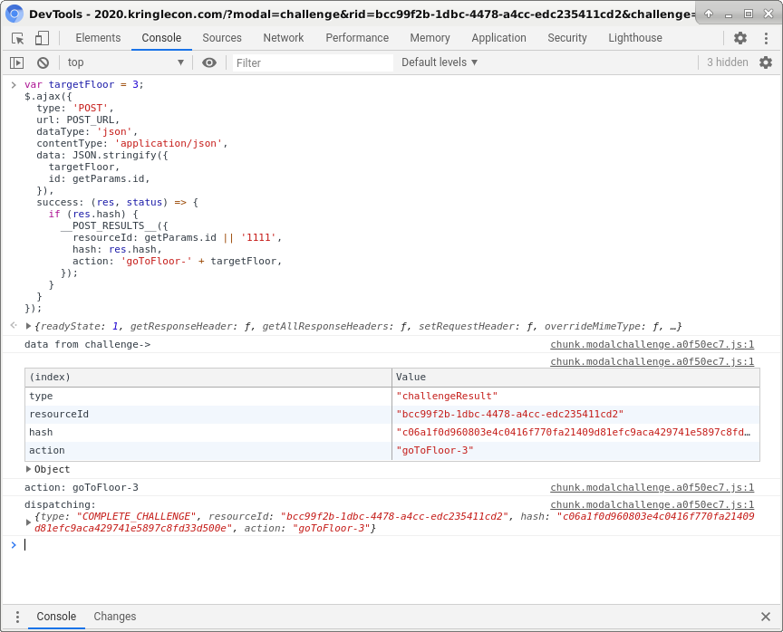

# Writeup for SANS Holiday Hack Challenge 2020 - 'Zat You, Santa Claus? featuring KringleCon 3: French Hens
# 10. Defeat Fingerprint Sensor
## 10.0. Description
Bypass the Santavator fingerprint sensor. Enter Santa's office without Santa's fingerprint.
##10.1. Solution
To solve this objective I operated the santavator the same as [Objective 4](../04), just by specifying the proper floor:
```javascript
var targetFloor = 3;
$.ajax({
  type: 'POST',
  url: POST_URL,
  dataType: 'json',
  contentType: 'application/json',
  data: JSON.stringify({ 
    targetFloor,
    id: getParams.id,
  }),
  success: (res, status) => {
    if (res.hash) {
      __POST_RESULTS__({
        resourceId: getParams.id || '1111',
        hash: res.hash,
        action: 'goToFloor-' + targetFloor,
      });
    }
  }
});
```

## 10.3. ...actually…
Actually I’ve spent some time thinking why this objective looked so straightforward to me… I mean, could it simply be the same, identical, solution of another objective? So I did my homework and landed on your [github](https://github.com/CounterHack/HolidayHack2020/issues/36). Now I know… how many “wrong” solutions did I collect so far? 3 out of 11? I’m proud of them and I’ll never correct them anyway 😁

## 10.2. Because sometimes root is not the way


---
# 11a. [Naughty/Nice List with Blockchain Investigation Part 1](../11a.%20Naughty-Nice%20List%20with%20Blockchain%20Investigation%20Part%201/README.md)
# 11b. [Naughty/Nice List with Blockchain Investigation Part 2](../11b.%20Naughty-Nice%20List%20with%20Blockchain%20Investigation%20Part%202/README.md)

---
# 0. [thedead@asian:~$ whoami](../README.md)
# ?. [33.6 Kbps](../%20%3F.%2033.6%20Kbps/README.md)
# 1. [Uncover Santa's Gift List](../01.%20Uncover%20Santa's%20Gift%20List/README.md)
# 2. [Investigate S3 Bucket](../02.%20Investigate%20S3%20Bucket/README.md)
# 3. [Point-of-Sale Password Recovery](../03.%20Point-of-Sale%20Password%20Recovery/README.md)
# 4. [Operate the Santavator](../04.%20Operate%20the%20Santavator/README.md)
# 5. [Open HID Lock](../05.%20Open%20HID%20Lock/README.md)
# 6. [Splunk Challenge](../06.%20Splunk%20Challenge/README.md)
# 7. [Solve the Sleigh's CAN-D-BUS Problem](../07.%20Solve%20the%20Sleigh's%20CAN-D-BUS%20Problem/README.md)
# 8. [Broken Tag Generator](../08.%20Broken%20Tag%20Generator/README.md)
# 9. [ARP Shenanigans](../09.%20ARP%20Shenanigans/README.md)