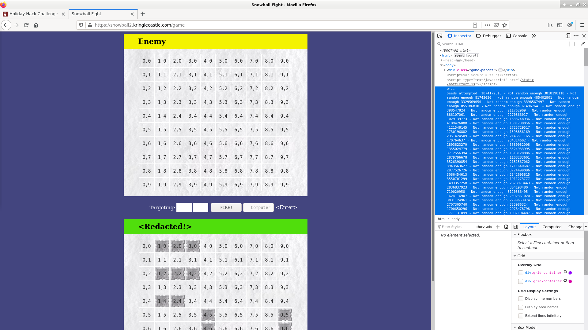
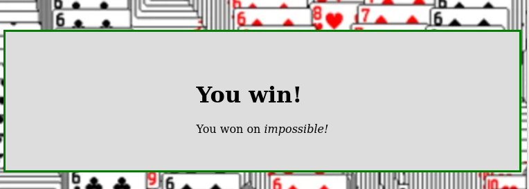

# Writeup for SANS Holiday Hack Challenge 2020 - 'Zat You, Santa Claus? featuring KringleCon 3: French Hens
# 11a. Naughty/Nice List with Blockchain Investigation Part 1
## 11a.0. Description
Even though the chunk of the blockchain that you have ends with block 129996, can you predict the nonce for block 130000? Talk to Tangle Coalbox in the Speaker UNpreparedness Room for tips on prediction and Tinsel Upatree for more tips and tools. (Enter just the 16-character hex value of the nonce)
## 11a.1. Side Challenge - Snowball Fight
The snowball fight player and enemy boards are derived from the name of the player. After playing around with the easy level I took a look at the impossible which had the right amount of attempted player names in the comment to allow the prediction of the current one assuming they were calculated using the Mersenne Twister:

```bash
thedead@dellian:~$ curl 'https://snowball2.kringlecastle.com/game' --data-raw 'difficulty=3' 2>/dev/null | grep "Not random enough" | wc -l
624
thedead@dellian:~$ curl 'https://snowball2.kringlecastle.com/game' --data-raw 'difficulty=3' 2>/dev/null | grep "Not random enough" | tr -d " \-Notrandmeugh" | sed --expression=':a;N;$!ba;s/\n/ /g'
1288447468 3454901085 2902031493 3163948016 1894336471 4052933811 1494316506 4253266242 2831048658 2988909930 345231510 663801031 1937635642 3976207603 1764151708 1962383725 656059445 102126933 1921770404 681380905 949846570 2884335345 1631651297 2619795212 4120270078 2530159621 1964470970 1860578706 2526867018 3274061153 2493559973 2140506419 1304262930 1945051353 3686897928 3954165592 1482771331 1606844906 3969134556 2403577977 3233668319 2471467477 1145709687 346994472 4136031514 2234283628 126386100 328102043 1147441594 1848272344 498615598 3947861788 3684404142 2940417340 3849998364 529804910 640675542 237055530 521809030 3677044935 4070110516 3002077485 2300865155 57889643 1436940733 3073951628 1583249997 1555271140 774045188 588910400 1972990420 963124439 1169221831 2267892228 1435922692 4026710146 1818423804 2940405181 3506356156 1397705691 3310092867 1556098989 4140891566 3800359625 558743277 2968947850 1433937561 1196654856 4032647481 2643147226 2878395870 3047823278 1985391844 3196570438 986493479 1805482736 1567306132 3682004227 1060000695 2515520413 4001801646 2972579940 2433193850 1828035375 423581746 480857568 615939602 3015483539 557141874 544077229 2888051324 110133900 3248947602 1172316241 331758284 371572707 381793816 2296366317 2994951138 2904459455 3835377318 984825845 3159175877 3240238136 558012818 95241706 3659079503 538059373 2621603526 100424878 2555843904 1536228946 3474860086 374128569 3395772290 3059998362 3841278653 1600158401 4116027681 298856918 2675286369 1734171347 726427177 3038497354 1892246389 1704077779 3403648489 807198799 4014520809 2370622231 820449812 3694836104 3472366313 3002838453 723121141 197790052 2524362047 2738212512 1205955222 846348883 1360907425 3988359079 747598964 590955344 780345146 3054161557 933629325 2570839029 260688698 2313207089 1529587589 318010393 2275100284 3602093893 3396201690 2450168070 1005794296 4021304480 2169725342 3462309926 2163350486 455173918 2582685450 841411172 1097142353 1210612585 3786108772 4091976406 2274388270 1002809018 3078964693 250652629 722556221 1483390641 1220123403 620651817 1010436923 3014646194 2893321215 2930525585 1905318693 583727704 1993705908 4095058256 58041364 402397312 3720941230 822258186 2188136420 2349954348 1769788839 3154420457 796376674 985279888 4007389139 2133938658 2418224517 823475365 2216686511 1022735360 3258841165 434862274 3784782231 3315298411 3905371782 2686733563 2462741003 1766931042 3498672095 458841762 2687505715 3637850542 4277620073 2641192850 3641878364 2016366774 1967690071 3688836875 2724850168 1524361303 3159990532 2536843726 458443654 2465990864 249507246 4197095421 3941687423 432013694 3489224537 4236298814 2067448541 1106773177 3767483473 3804057320 1178552177 4255594207 2838279020 4034195907 1282831524 441048154 3500114373 3729516038 2510035589 3375953502 3273609465 272514881 2861075248 197080880 3516431223 1445620889 4294686768 1057118763 621673668 553806883 1192153429 1181558700 3996821262 3415966606 3249162685 4222259690 2490358476 427822897 1873796509 2909695826 2060438738 4141421055 829219606 2625400175 3894950676 1374035521 481806185 4095697376 4130219432 3955457347 2919165332 4104607696 4064049926 2582740643 1434425891 346533649 1294418969 308644048 1439709043 3625099405 2424640944 2552528127 2594271644 863712248 371534764 2099650161 3762687312 2108727935 651546474 3183279698 1975969757 568979984 3902313928 257011746 1285043701 1217189320 3189937269 988189545 2745451827 4194046273 1938808058 3103034461 2519986634 1794888204 1547578324 1025313974 3432094792 3558912385 1830818171 1768490972 1219640352 3943853987 2826614734 2000577003 2650468543 4179336313 2814150497 3184091034 2816024954 847143706 504318373 1514379282 150283753 3342230359 4234344586 1048115512 2980431106 4067802641 1526531753 3257903996 1452309124 2568299871 2784659520 1500525636 1472859135 881211454 1639088511 3057104132 1966148990 99367945 3142350655 180967158 355163415 1597144514 1135445608 788334642 1819501979 1088832439 2252882613 575401022 1694959767 1370149553 3407090234 2003228271 1222200346 3332784496 4202161738 545987956 4011845957 2667511766 1560407827 3277669878 416364923 4244133118 1009135815 2626089004 1285370326 2113180977 1840680831 1365311634 166588528 1089276964 3341324394 1694069207 2236931943 1714596768 3253483240 2683945760 3516376886 3489651546 420450464 2255220696 2938330098 845701814 3676543149 2429792214 2442484714 782657840 20736620 2938094340 209793228 2572965068 2762851710 1274719964 3634563954 2205942884 1752334911 2955632081 4127989706 2475040343 1904058512 22153810 3662702831 2532712864 32662129 3879870252 2584891089 2080750493 2393750940 633218795 614311090 970867057 2640135383 170500764 1773318251 2343747425 1484126070 2847901866 1589252198 3196681651 1667584655 1388489168 1014247292 2547572429 685628588 3907409409 2018039507 1635626790 2356260360 2143985838 3305271915 2911744115 1827832883 1381467437 3442080166 3846525321 3216932881 4027021527 4143596491 3048513746 3249359983 2521382603 3678768155 1812583608 936966233 1955393999 1300433886 2312347581 3897483049 1807797734 1910744015 2241393841 526241518 1927784687 3677212725 2529921050 4040618343 914535463 1102337243 285133258 3612283737 3018660580 400110146 1642116871 3473455244 3388306443 526579636 2242915250 2052138511 1196179575 3474942832 53141030 1806714736 681838617 1634378237 221701859 3482519379 101439748 3908508266 1557155947 947648440 3973542705 221407723 393592186 3548531946 2418519069 2031791453 1956485308 1733332905 3326459934 696595703 2399269056 2588690532 2418704707 3117627838 851549985 369892732 2787300441 2270381770 3504832997 3644831278 2605105023 3525038254 3846102699 4018048125 1884707439 1209377268 723531579 7928540 2003876600 2083507343 3501648786 1316124289 1539611653 3509043816 1998322134 4224357036 3980158707 1163684337 612138298 1858227867 2311666531 1037115219 3537954857 4245004571 809377748 4056037820 1168989742 144253569 2889990242 1672200105 822141776 1681970615 3468946294 28515636 2071013391 2112973986 3548564632 2966987531 3296388692 1822387812 3146627155 2051154234 819928666 3198502845 4071242949 4063091401 2123177747 2011312452 3361526760 498683290 803008465 1853552506 3209303066 3101009563 3004122177 4051331522 598106144 3171363139 2720561553 3027456325 3390647148 612473762 1102821800 4067606633 3894797261 1991114139 1282185005 789642129 440707103 3484081643 301631246 2203997998 3019730426 49492783 3910307423 3178364361 3399330048 3163518980 3689592238 1155838890 4054016629 671547652 1763958437 3951007463 3204721039 895586824 2420292643 1940201139 2869028101 3462271426 3643146455 3224836929 396796456 3021298703 316947864 3454795732 2794125321 3532160923 498367787
```
Searching the web for a Mersenne Twister predictor I found the [Mersenne Twister Predictor github by kmyk](https://github.com/kmyk/mersenne-twister-predictor) which to me looked more trivial than the one offered in the slides and it was sufficient to give the above mentioned numbers as input to get the predicted one:
```bash
thedead@dellian:~$ curl 'https://snowball2.kringlecastle.com/game' --data-raw 'difficulty=3' 2>/dev/null | grep "Not random enough" | tr -d " \-Notrandomenough" | mt19937predict | head -n 1
2561733258
```
Back to the game, copy-pasted to a file the values printed in the iframe, sent them as input for the mt19937predict, and got the expected username. Used this username for easy difficulty and being able to win, I had the enemy layout so I shooted down the adversary also in impossible mode.  


## 11a.2. Hints
> **MD5 Hash Collisions** - Tangle Coalbox: *“If you have control over to bytes in a file, it's easy to create MD5 hash collisions. Problem is: there's that nonce that he would have to know ahead of time.”*

## 11a.3. Solution
To solve this challenge I reused the Mersenne Twister predictor by providing the nonces of blocks I had in the blockchain.dat file as input. Then I made the predictor calculate the nonces up to 130000. To do this I wrote a short script relying on classes and functions in the `naughty_nice.py` file:
```python
#!/usr/bin/env python3
import random
from mt19937predictor import MT19937Predictor
from naughty_nice import Block, Chain

if __name__ == '__main__':
    predictor = MT19937Predictor()
    index = None
    c2 = Chain(load=True, filename='blockchain.dat')
    for b in c2.blocks:
        index = b.index
        predictor.setrandbits(int(b.nonce), 64)
        print ("Index {} | Nonce {} (Hex {})".format(index, b.nonce, hex(b.nonce)))
    while index < 130000:
        index += 1
        new_index = predictor.getrandbits(64)
        print ("Index {} | Predicted Nonce {} (Hex {})".format(index, new_index, hex(new_index)))
```
Executing the script I obtained the nonce `6270808489970332317` (Hex `0x57066318f32f729d`) for block `130000`:
```bash
thedead@dellian:~/Desktop/repos/KringleCon3/11a$ python3 solution.py | tail 
Index 129991 | Nonce 5643972521975276755 (Hex 0x4e536b1b0e66e4d3)
Index 129992 | Nonce 12288628311000202778 (Hex 0xaa89fa5745f9be1a)
Index 129993 | Nonce 14033042245096512311 (Hex 0xc2bf619259071b37)
Index 129994 | Nonce 9999237799707722025 (Hex 0x8ac46dccf43cc129)
Index 129995 | Nonce 7556872674124112955 (Hex 0x68df67a8ba06243b)
Index 129996 | Nonce 16969683986178983974 (Hex 0xeb806dad1ad54826)
Index 129997 | Predicted Nonce 13205885317093879758 (Hex 0xb744baba65ed6fce)
Index 129998 | Predicted Nonce 109892600914328301 (Hex 0x1866abd00f13aed)
Index 129999 | Predicted Nonce 9533956617156166628 (Hex 0x844f6b07bd9403e4)
Index 130000 | Predicted Nonce 6270808489970332317 (Hex 0x57066318f32f729d)
```
## 11a.4. Did you know…?
Did you know that also Google has its own [christmas snowball fight game](https://santatracker.google.com/snowball.html)? 

---
# 11b. [Naughty/Nice List with Blockchain Investigation Part 2](../11b.%20Naughty-Nice%20List%20with%20Blockchain%20Investigation%20Part%202/README.md)

---
# 0. [thedead@asian:~$ whoami](../README.md)
# ?. [33.6 Kbps](../%20%3F.%2033.6%20Kbps/README.md)
# 1. [Uncover Santa's Gift List](../01.%20Uncover%20Santa's%20Gift%20List/README.md)
# 2. [Investigate S3 Bucket](../02.%20Investigate%20S3%20Bucket/README.md)
# 3. [Point-of-Sale Password Recovery](../03.%20Point-of-Sale%20Password%20Recovery/README.md)
# 4. [Operate the Santavator](../04.%20Operate%20the%20Santavator/README.md)
# 5. [Open HID Lock](../05.%20Open%20HID%20Lock/README.md)
# 6. [Splunk Challenge](../06.%20Splunk%20Challenge/README.md)
# 7. [Solve the Sleigh's CAN-D-BUS Problem](../07.%20Solve%20the%20Sleigh's%20CAN-D-BUS%20Problem/README.md)
# 8. [Broken Tag Generator](../08.%20Broken%20Tag%20Generator/README.md)
# 9. [ARP Shenanigans](../09.%20ARP%20Shenanigans/README.md)
# 10. [Defeat Fingerprint Sensor](../10.%20Defeat%20Fingerprint%20Sensor/README.md)