# Writeup for SANS Holiday Hack Challenge 2020 - 'Zat You, Santa Claus? featuring KringleCon 3: French Hens
# 11b. Naughty/Nice List with Blockchain Investigation Part 2
## 11b.0. Description
The SHA256 of Jack's altered block is: `58a3b9335a6ceb0234c12d35a0564c4ef0e90152d0eb2ce2082383b38028a90f`. If you're clever, you can recreate the original version of that block by changing the values of only 4 bytes. Once you've recreated the original block, what is the SHA256 of that block?
## 11b.1. Hints
> **Imposter Block Event** - Tangle Coalbox: *“Shinny Upatree swears that he doesn't remember writing the contents of the document found in that block. Maybe looking closely at the documents, you might find something interesting.”*  
> **Unique Hash Collision** - Tangle Coalbox: *“If Jack was somehow able to change the contents of the block AND the document without changing the hash... that would require a very UNIque hash COLLision.”*  
> **Blockchain ... Chaining** - Tangle Coalbox: *“A blockchain works by "chaining" blocks together - each new block includes a hash of the previous block. That previous hash value is included in the data that is hashed - and that hash value will be in the next block. So there's no way that Jack could change an existing block without it messing up the chain...”*  
> **Minimal Changes** - Tangle Coalbox: *“Apparently Jack was able to change just 4 bytes in the block to completely change everything about it. It's like some sort of evil game to him.”*  
> **Block Investigation** - Tangle Coalbox: *“The idea that Jack could somehow change the data in a block without invalidating the whole chain just collides with the concept of hashes and blockchains. While there's no way it could happen, maybe if you look at the block that seems like it got changed, it might help.”*  
> **Blockchain Talk** - Tangle Coalbox: *“Qwerty Petabyte is giving a talk about blockchain tomfoolery!”*  
## 11b.2. Solution
The idea behind this challenge is about “undoing” an Unicoll attack against MD5 hashes, knowing the colliding block in the blockchain and that four bytes were altered.
To identify the target block and obtain its content I wrote a script which allows to calculate the SHA256 of the block and also to dump the relevant block data:
```python
#!/usr/bin/env python3
import random
from Crypto.Hash import MD5, SHA256
from naughty_nice import Block, Chain

def full_hash_SHA256(block):
    hash_obj = SHA256.new()
    hash_obj.update(block.block_data_signed())
    return hash_obj.hexdigest()

if __name__ == '__main__':
    c = Chain(load=True, filename='blockchain.dat')
    for b in c.blocks:
        if (full_hash_SHA256(b)) == "58a3b9335a6ceb0234c12d35a0564c4ef0e90152d0eb2ce2082383b38028a90f":
            n_n = "Naughty"
            if b.sign != 0:
                n_n = "Nice"
            
            print ("Block found @ Index {} ({})".format(b.index, hex(b.index)))
            print ("MD5 {} | SHA256 {}".format(b.full_hash(), full_hash_SHA256(b)))
            print ("Sign {} ({}) | Value {}".format(hex(b.sign), n_n, hex(b.score)))
            i = 0
            while i < len(b.data):
                b.dump_doc(i)
                i += 1
```
Executing the script allowed to identify the block `129459` (`0x1f9b3`):
```bash
thedead@dellian:~/Desktop/repos/KringleCon3/11b$ python3 findBlock.py 
Block found @ Index 129459 (0x1f9b3)
MD5 b10b4a6bd373b61f32f4fd3a0cdfbf84 | SHA256 58a3b9335a6ceb0234c12d35a0564c4ef0e90152d0eb2ce2082383b38028a90f
Sign 0x1 (Nice) | Value 0xffffffff
Document dumped as: 129459.pdf
Document dumped as: 129459.bin
```
While the bin didn’t looked like a useful file, further investigations on the pdf shown that potentially it had more pages than shown, just it didn’t had a parent referencing it:
```bash
thedead@dellian:~/Desktop/repos/KringleCon3/11b$ file 129459.bin 
129459.bin: data
thedead@dellian:~/Desktop/repos/KringleCon3/11b$ strings 129459.pdf | grep Page
<</Type/Catalog/_Go_Away/Santa/Pages 2 0 R      0
<</Type/Pages/Count 1/Kids[23 0 R]>>
<</Type/Pages/Count 1/Kids[15 0 R]>>
<</Type/Page/Contents 4 0 R/Resources 5 0 R/MediaBox[0 0 612 792]/Parent 3 0 R>>
<</Type/Page/Contents 16 0 R/Resources 17 0 R/MediaBox[0 0 612 792]/Parent 2 0 R>>
```
Altering `/Type/Catalog/_Go_Away/Santa/Pages` from `2` to `3` causes the PDF to show its original content:
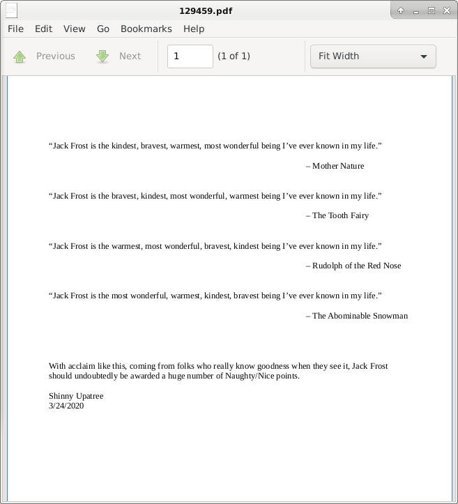
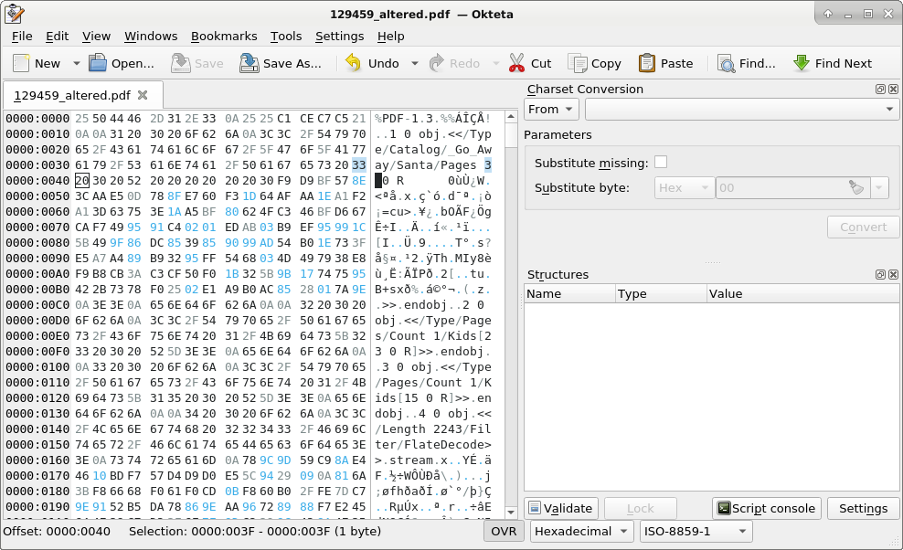
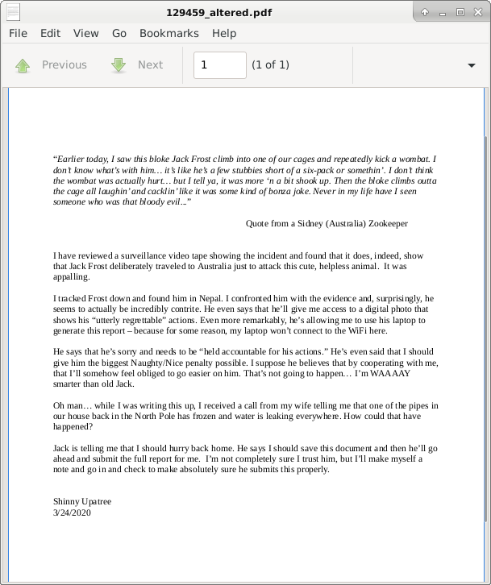

After looking a little more within the PDF itself I thought maybe I had to change something directly in the full block and ended up focusing on the Sign value from `0x1` (Nice) to `0x0` (Naughty). To be able to easily alter the value I copied out the section of the `blockchain.dat` file pertaining that block to a separated file (from offset `0016:302C` to `0016:D1EE`) which I called `129459.dat`.
I then made the changes to PDF and sign directly into that file:  
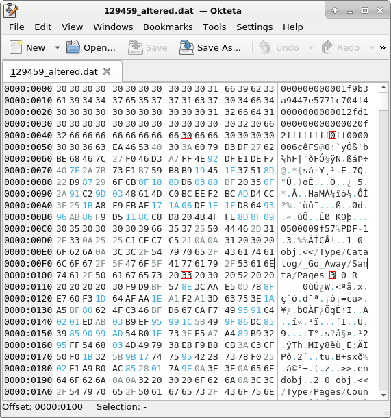

At that point it was obvious that the hash of the block was altered thus I wrote and executed a short script to compare the original (Jack’s) block with mine:
```python
#!/usr/bin/env python3
import random
from Crypto.Hash import MD5, SHA256
from naughty_nice import Block, Chain

def full_hash_SHA256(block):
    hash_obj = SHA256.new()
    hash_obj.update(block.block_data_signed())
    return hash_obj.hexdigest()

def brief_print(block):
    n_n = "Naughty"
    if block.sign != 0:
        n_n = "Nice"
    print ("Block found @ Index {} ({})".format(block.index, hex(block.index)))
    print ("MD5 {}".format(block.full_hash()))
    print ("SHA256 {}".format(full_hash_SHA256(block)))
    print ("Sign {} ({}) | Value {}".format(hex(block.sign), n_n, hex(block.score)))

if __name__ == '__main__':
    original_md5 = ""
    altered_md5 = ""
    original_sha256 = ""
    altered_sha256 = ""

    print ("##################")
    print ("# ORIGINAL BLOCK #")
    print ("##################")
    c = Chain(load=True, filename='blockchain.dat')
    for b in c.blocks:
        if (full_hash_SHA256(b)) == "58a3b9335a6ceb0234c12d35a0564c4ef0e90152d0eb2ce2082383b38028a90f":
            original_md5 = b.full_hash()
            original_sha256 = full_hash_SHA256(b)
            brief_print (b)

    print ("#################")
    print ("# ALTERED BLOCK #")
    print ("#################")
    c = Chain(load=True, filename='129459_altered.dat')
    for b in c.blocks:
        altered_md5 = b.full_hash()
        altered_sha256 = full_hash_SHA256(b)
        brief_print (b)

    print ("##################")
    print ("# HASHES COMPARE #")
    print ("##################")
    print ("   Original block MD5: {}".format(original_md5))
    print ("    Altered block MD5: {}".format(altered_md5))
    print ("           MD5s Match: {}".format(original_md5 == altered_md5))
    print ("Original block SHA256: {}".format(original_sha256))
    print (" Altered block SHA256: {}".format(altered_sha256))
    print ("        SHA256s Match: {}".format(original_sha256 == altered_sha256))
```
```bash
thedead@dellian:~/Desktop/repos/KringleCon3/11b$ python3 block_compare.py 
##################
# ORIGINAL BLOCK #
##################
Block found @ Index 129459 (0x1f9b3)
MD5 b10b4a6bd373b61f32f4fd3a0cdfbf84
SHA256 58a3b9335a6ceb0234c12d35a0564c4ef0e90152d0eb2ce2082383b38028a90f
Sign 0x1 (Nice) | Value 0xffffffff
#################
# ALTERED BLOCK #
#################
Block found @ Index 129459 (0x1f9b3)
MD5 e1062980af8cc859c57546604af19883
SHA256 17a4022e8450fd838bd53dd57efba263af1660282f0c851cbfe5c8d65da76c54
Sign 0x0 (Naughty) | Value 0xffffffff
##################
# HASHES COMPARE #
##################
   Original block MD5: b10b4a6bd373b61f32f4fd3a0cdfbf84
    Altered block MD5: e1062980af8cc859c57546604af19883
           MD5s Match: False
Original block SHA256: 58a3b9335a6ceb0234c12d35a0564c4ef0e90152d0eb2ce2082383b38028a90f
 Altered block SHA256: 17a4022e8450fd838bd53dd57efba263af1660282f0c851cbfe5c8d65da76c54
        SHA256s Match: False
```
Multiple tentatives, suggestions and re-reading through the slides after I was able to find out the other two bytes I had to fix to revert the hash collision Jack made I identified bytes 0x89 and 0x149 as my targets. So I made my math on the relevant offsets:  
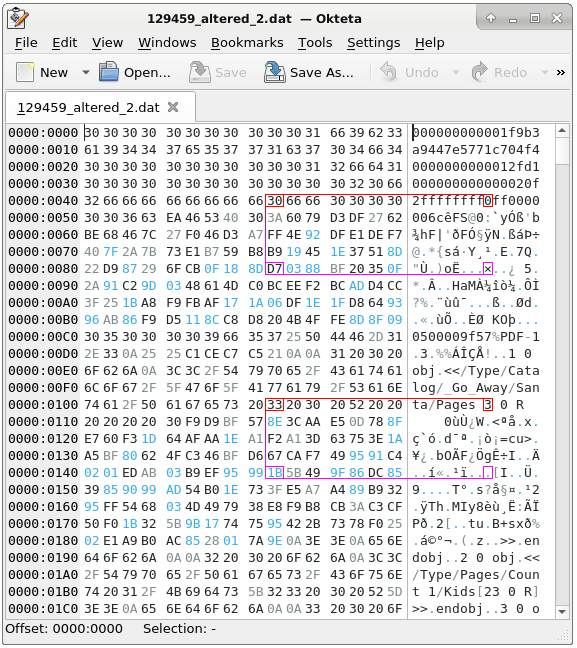

Another execution of the previous script shown that it worked and the SHA256 hash for the block became `fff054f33c2134e0230efb29dad515064ac97aa8c68d33c58c01213a0d408afb`:
```bash
thedead@dellian:~/Desktop/repos/KringleCon3/11b$ python3 block_compare.py 
##################
# ORIGINAL BLOCK #
##################
Block found @ Index 129459 (0x1f9b3)
MD5 b10b4a6bd373b61f32f4fd3a0cdfbf84
SHA256 58a3b9335a6ceb0234c12d35a0564c4ef0e90152d0eb2ce2082383b38028a90f
Sign 0x1 (Nice) | Value 0xffffffff
#################
# ALTERED BLOCK #
#################
Block found @ Index 129459 (0x1f9b3)
MD5 b10b4a6bd373b61f32f4fd3a0cdfbf84
SHA256 fff054f33c2134e0230efb29dad515064ac97aa8c68d33c58c01213a0d408afb
Sign 0x0 (Naughty) | Value 0xffffffff
##################
# HASHES COMPARE #
##################
   Original block MD5: b10b4a6bd373b61f32f4fd3a0cdfbf84
    Altered block MD5: b10b4a6bd373b61f32f4fd3a0cdfbf84
           MD5s Match: True
Original block SHA256: 58a3b9335a6ceb0234c12d35a0564c4ef0e90152d0eb2ce2082383b38028a90f
 Altered block SHA256: fff054f33c2134e0230efb29dad515064ac97aa8c68d33c58c01213a0d408afb
        SHA256s Match: False
```
## 11b.3. Special thanks
How could I not give a big thanks to another participant who helped me with this challenge?

## 11b.4. Behind the scenes with those two last bytes
I’ve been working to understand the two last bytes of the four tampered by Jack. At a certain point I started taking notes on post-its about the structure of the block and about what and where I could change and what was not supposed to be changed:
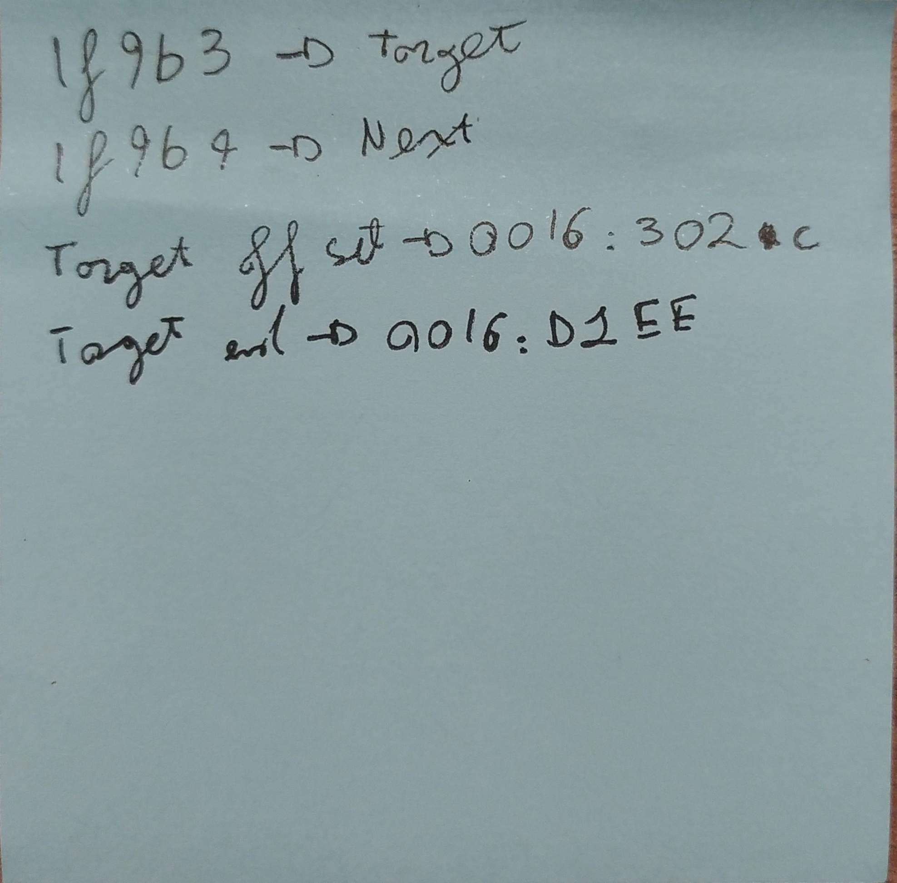
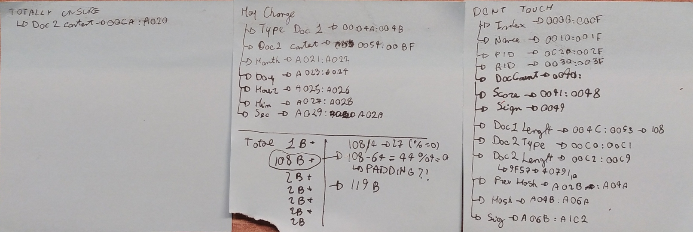

I thought that maybe I could work my way out with some bruteforcing but ~120B of bruteforce is not something I could realistically do. Anyway I knew I had to cause an hash collision so I played around with modifying the block and looking at the produced hashes until I had a feeling about one of the hashes produced:
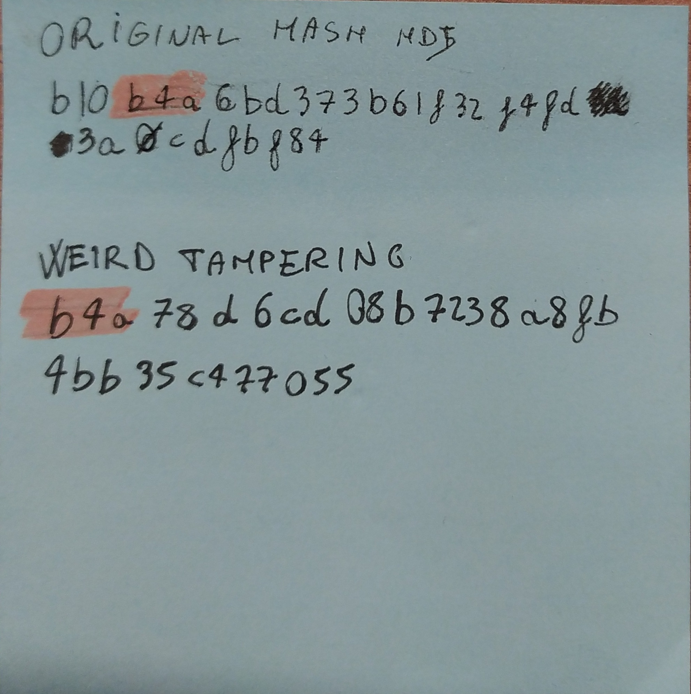

This MD5 looked like the `b4a` shifted left and I did not believe in a coincidence. That was the moment I actually started to place together information I had about Unicoll and I knew I had to search for some pattern I was not able to find. I recalled a talk about malware analysis where the guy said he writes hex on paper as it helps him to find patterns. If it works for him why not for me? So I did the same, even though I mixed hex values and chars for readability 😁
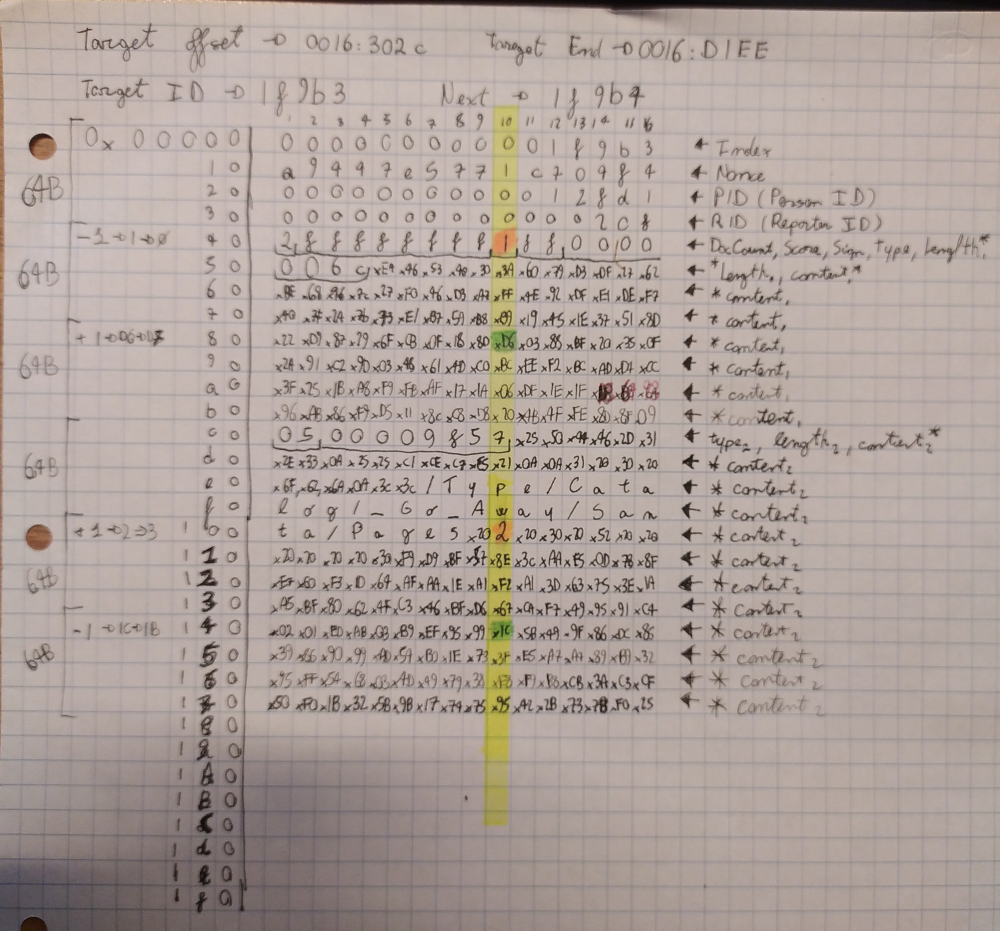

After writing on paper from `0x0` to `0x10F` I highlighted those bytes I wanted to alter with an orange marker. I noticed that they were both on the same column, so I wrote the column number on top (shame on me, in decimal and starting from 1 😁).

These were both on column 10 so I highlighted the column with a yellow marker. The Unicoll requires altering the 10th byte of one block and the 10th of a contingent one. I tried highlighting the 64B blocks on the leftmost side of the page and the operations I wanted to do on bytes `0x49` and `0x109`.

At that point everything came clear: Jack modified the 10th character of the 2nd and of the 5th block being able to perform the unicoll attack to MD5 hashes.

Undoing it meant to rollback changes that were made by the attacker without invalidating the blockchain and the block structure. I also assumed the bin file was “garbage” added for padding purposes.

Here the story just finishes: I subtracted 1 to `0x49` and added 1 to `0x89`, added 1 to `0x109` and subtracted 1 to `0x149`...aaaand it worked 😁

Recall the sentence in whoami? Now you know: this challenge made me transcribe 384 Byte on paper 😁
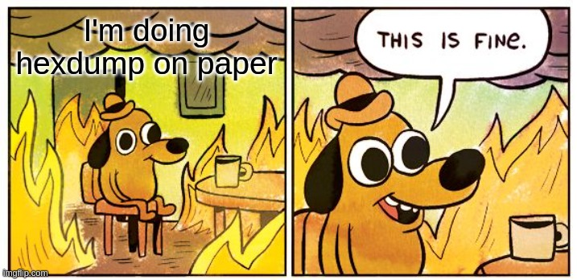

Also to recall the whoami, there is a neat book by Cliff Stoll regarding that “Splunk on paper” thing:
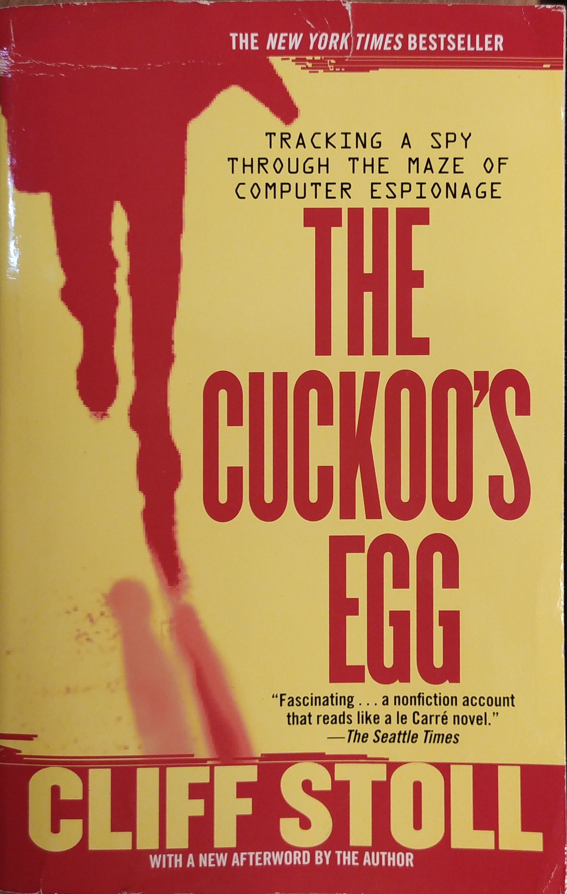


---
# 0. [thedead@asian:~$ whoami](../README.md)
# ?. 33.6 Kbps
# 1. Uncover Santa's Gift List
# 2. Investigate S3 Bucket
# 3. Point-of-Sale Password Recovery
# 4. Operate the Santavator
# 5. Open HID Lock
# 6. Splunk Challenge
# 7. Solve the Sleigh's CAN-D-BUS Problem
# 8. Broken Tag Generator
# 9. ARP Shenanigans
# 10. Defeat Fingerprint Sensor
# 11a. Naughty/Nice List with Blockchain Investigation Part 1