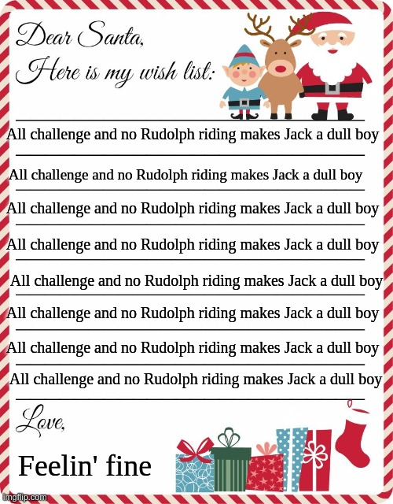

# Writeup for SANS Holiday Hack Challenge 2020 - 'Zat You, Santa Claus? featuring KringleCon 3: French Hens
## 0. thedead@dellian:~$ whoami
```bash
thedead@dellian:~$ whoami

Andrea Lamonato
System Security Specialist

mailto: lamonato.andrea@gmail.com

Github:   https://github.com/LamonatoAndrea
Linkedin: https://www.linkedin.com/in/andrea-lamonato/


Films watched while working on KringleCon 3:
	➤ Annihilation ➤ Avengers: Endgame ➤ Avengers: Infinity war
	➤ Black Panther ➤ Captain Marvel ➤ Cargo ➤ Code 8 ➤ Doom
	➤ Dream house ➤ Dreamcatcher ➤ Errementari ➤ Gerald’s game
	➤ House at the end of the street ➤ Hungerford 
	➤ The girl with all the gifts ➤ The invisible guardian
	➤ The midnight sky ➤ Thor ➤ Toy story of terror! ➤ Troll hunter

..."And Splunk doesn’t work very well on paper" (Cliff Stoll)
..."Neither hex editing does" (Me working on Objective 11b)
```
### 0.1. ["And Splunk doesn’t work very well on paper"](https://www.youtube.com/watch?v=ddAtMMDeeq8)

# ?. [33.6 Kbps](%20%3F.%2033.6%20Kbps/README.md)
# 1. [Uncover Santa's Gift List](01.%20Uncover%20Santa's%20Gift%20List/README.md)
# 2. [Investigate S3 Bucket](02.%20Investigate%20S3%20Bucket/README.md)
# 3. [Point-of-Sale Password Recovery](03.%20Point-of-Sale%20Password%20Recovery/README.md)
# 4. [Operate the Santavator](04.%20Operate%20the%20Santavator/README.md)
# 5. [Open HID Lock](05.%20Open%20HID%20Lock/README.md)
# 6. [Splunk Challenge](06.%20Splunk%20Challenge/README.md)
# 7. [Solve the Sleigh's CAN-D-BUS Problem](07.%20Solve%20the%20Sleigh's%20CAN-D-BUS%20Problem/README.md)
# 8. [Broken Tag Generator](08.%20Broken%20Tag%20Generator/README.md)
# 9. [ARP Shenanigans](09.%20ARP%20Shenanigans/README.md)
# 10. [Defeat Fingerprint Sensor](10.%20Defeat%20Fingerprint%20Sensor/README.md)
# 11a. [Naughty/Nice List with Blockchain Investigation Part 1](11a.%20Naughty-Nice%20List%20with%20Blockchain%20Investigation%20Part%201/README.md)
# 11b. [Naughty/Nice List with Blockchain Investigation Part 2](11b.%20Naughty-Nice%20List%20with%20Blockchain%20Investigation%20Part%202/README.md)
# 12. Narrative
KringleCon back at the castle, set the stage...

But it's under construction like my GeoCities page.

Feel I need a passport exploring on this platform -

Got half floors with back doors provided that you hack more!

Heading toward the light, unexpected what you see next:

An alternate reality, the vision that it reflects.

Mental buffer's overflowing like a fast food drive-thru trash can.

Who and why did someone else impersonate the big man?

You're grepping through your brain for the portrait's "JFS"

"Jack Frost: Santa," he's the villain who had triggered all this mess!

Then it hits you like a chimney when you hear what he ain't saying:

Pushing hard through land disputes, tryin' to stop all Santa's sleighing.

All the rotting, plotting, low conniving streaming from that skull.

Holiday Hackers, they're no slackers, returned Jack a big, old null!
# 13. What’s next?
Thanks for the interesting challenge guys and see you next year!

Maybe I also found out why Jack Frosty was so grinchy this year...
  
...did I ask to make a [run run Rudolph](https://www.youtube.com/watch?v=YiadNVhaGwk) challenge next year already?